<div align="center">

# 🚀 Universal AI Agent DevKit & Quality Protocol
### *Shared rules, lifecycle hooks, 25 skills, domain profiles (Android, iOS, web, backend, game, automotive, voice, universal) and a static post-fix diff gate for Claude Code, OpenAI Codex, Google Gemini/Antigravity and Cursor — installed into your project without overwriting what is already there.*

[](https://github.com/ToanMobile/agent-workbench)
[](./LICENSE)
[](#-verification--devkit-cli-agent-kit)
[](#-universal-multi-agent-matrix)
[-red.svg?style=for-the-badge)](#-complete-rulebook--engineering-standards-single-source-of-truth)
[](#-25-curated-engineering-skills-catalog)
[](#-dynamic-domain-profiles-system)
[](#-10-review-councils--self-consistency-checks)
[](#-mcp-model-context-protocol-hub)

<p align="center">
  🌐 <b>Languages:</b> <a href="README.md"><b>English 🇺🇸</b></a> • <a href="README.vi.md"><b>Tiếng Việt 🇻🇳</b></a>
</p>

<p align="center">
  <b>One DevKit to rule them all:</b> Elevate your AI coding assistants from conversational LLMs into rigorous, disciplined, and evidence-backed <b>Principal Pair Programmers</b>.
</p>

[Quick Start](#-quick-start--installation) • [Architecture](#-system-architecture) • [Workflows](#-production-engineering-workflows) • [Domain Profiles](#-dynamic-domain-profiles-system) • [Post-Fix Gate](#-post-fix-gate-static-diff-gate--regression-tests) • [Councils](#-10-review-councils--self-consistency-checks) • [Which command when](#-qa-commands-which-one-when) • [Team / CI](#-team--ci-usage) • [Uninstall](#-uninstall--restoring-_old-backups) • [Troubleshooting](#-troubleshooting) • [Multi-Agent Matrix](#-universal-multi-agent-matrix) • [Rulebook SSOT](#-complete-rulebook--engineering-standards-single-source-of-truth) • [Skills Catalog](#-25-curated-engineering-skills-catalog) • [MCP Hub](#-mcp-model-context-protocol-hub) • [Verification](#-verification--devkit-cli-agent-kit)

---

</div>

## 🎯 What It Is, and Who It Is For

AI coding agents are fast but will happily claim "tests pass" without running them, rewrite files with `// ... existing code ...`, force-push, or commit a keystore. This DevKit gives the agent a shared rulebook (`AGENTS.md`), lifecycle hooks that block the worst of that in Claude Code, reusable skills/slash commands, and a post-fix gate you run before calling a change done. It is aimed at solo developers and small teams using Claude Code, Codex, Gemini/Antigravity or Cursor; the skills and hooks lean towards Android/Kotlin, with profiles for iOS, web, backend, game (Unity), automotive, voice-assistant and general projects.

## 🚀 Quick Start & Installation

### Option 1: Remote One-Liner (Zero-Clone)

```bash
# Interactive Mode (Recommended — prompts for domain profile and agent platforms):
/bin/bash -c "$(curl -fsSL https://raw.githubusercontent.com/ToanMobile/agent-workbench/main/universal-agent-devkit/bin/quick-install.sh)"

# Quick non-interactive setup (Configures all core agents automatically):
curl -fsSL https://raw.githubusercontent.com/ToanMobile/agent-workbench/main/universal-agent-devkit/bin/quick-install.sh | bash
```

---

### Option 2: Clone & Global CLI Setup (Recommended)
```bash
# 1. Clone the repository
git clone https://github.com/ToanMobile/agent-workbench.git
cd agent-workbench/universal-agent-devkit

# 2. Install agent-kit globally to ~/.local/bin
make install

# 3. Initialize DevKit instantly inside ANY project on your machine
cd /path/to/your-project
agent-kit init
```

#### Useful `agent-kit init` forms
```bash
agent-kit init                          # interactive, current directory
agent-kit init ../my-app -y             # non-interactive: all agents, profile from the detected domain
agent-kit init -p android -a claude     # one profile, one agent
agent-kit init -m copy                  # real files instead of symlinks (see Team / CI)
agent-kit init --lang=vi                # agent replies in Vietnamese
```
`--lang` (`vi` | `en`) also sets the language of installer, profile, health and gate output. Order: `--lang` > `$DEVKIT_LANG` > `lang` saved in `.agents/active-profile.json` > `vi`.
Invalid options, profiles or modes exit with status 2 before anything is written.

#### What the installer does to an existing project
- DevKit is the core. Your own skills/commands/agents/hooks with a DevKit name move to the **project tier** `.agents/local/<kind>/` (commit it) and the DevKit version is installed; items there with a free name are linked back in on every install. In copy mode, edits to a DevKit copy are kept there too (only the edited files). Top-level files (`CLAUDE.md`, `AGENTS.md`, `.cursorrules`) keep your content with a DevKit block injected, plus a `*_old` snapshot. Nothing is overwritten: see both with `agent-kit list-old`, undo with `agent-kit restore-old`. Re-running `agent-kit init` after updating the DevKit is safe — it never rewrites `.agents/local`. A root `rules/`/`skills/`/`commands/` holding only agent material (`*.md`, `SKILL.md` folders) moves to `.agents/local/` too; one holding the project's source code (e.g. `commands/build.js`) stays in place and gets the DevKit items placed inside it, so every DevKit path still resolves.
- A real `commands/`, `rules/` or `skills/` directory that belongs to your project (for example a CLI's own `commands/build.js`) is **left in place**; that DevKit item is skipped with a warning.
- Symlink mode in a git repository prints a warning: the links point into this checkout and break on other machines — use `-m copy` for committed setups.
- In a git project, `*_old*`, `.claude/audit-gate/` and the installer's ledgers are added to `.gitignore`.
- The installer never writes into the DevKit checkout itself.

---

### Option 3: Claude Code Plugin
```bash
claude plugin install github.com/ToanMobile/agent-workbench/universal-agent-devkit
# or from local path:
claude plugin install /path/to/agent-workbench/universal-agent-devkit
```

---

---

## 📖 Executive Summary

**Universal Agent DevKit** is an enterprise-grade engineering framework designed for the 5 core AI Coding Agents (**Claude Code**, **OpenAI Codex**, **Google Antigravity & Gemini CLI**, **Cursor IDE**, and **Grok**) and whichever model you run inside them (current Claude, GPT, Gemini, Grok or open-weight models — nothing here is tied to a specific model version).

It delivers a complete, closed-loop software engineering ecosystem:
1. **Supreme Engineering Protocols:** Zero-Defect Protocol, Paired Executable Oracle (RED→GREEN), and No-Fabrication Engine (C1–C9 Decision Table).
2. **Single Source of Truth Rulebook (`AGENTS.md`):** Eliminates rule sprawl and conflicting chapters by unifying all engineering standards, architecture rules, pre-code gates, and quality protocols into a single, authoritative master rule file (`AGENTS.md` / `Agent.md`).
3. **Dynamic Domain Profiles:** Instant project domain switching between **Android** (Compose/Vitals/Tombstones), **iOS** (Swift 6/SwiftUI/Concurrency), **Automotive** (AAOS/CAN), **Game** (Unity 6/Zero-GC), **Voice Assistant** (edge audio AI), **Web** (TypeScript/React/Next.js), **Backend** (API services in Python/Go/Rust/Node) and **Universal** clean architecture via `agent-kit profile`.
4. **Post-Fix Gate (`/audit-gate`, `agent-kit gate`, `postfix-gate`):** a static diff gate. What can make it fail: 6 static checks on the changed files (secrets, lazy placeholders, dependencies — floating versions like `1.+`/`latest`/`*` and `http://` package sources — performance anti-patterns, swallowed exceptions, raw logging) plus, with `--run-tests`, the regression tests from the active matrix. DESIGN.md/a11y, RED→GREEN proof, screenshots/devices and OpenCodeReview are printed as reminders — the gate does not verify them. The same static checks run as a git pre-commit hook on the staged content (installed by `agent-kit init` in git projects, or `agent-kit githooks install`), so a plain `git commit` from a terminal or IDE is checked too (you can skip once with `git commit --no-verify`; the agent cannot — the git guard blocks it); `agent-kit learn "<trap>" --cause=… --rule=…` records a lesson in `.agents/instincts.md` under the next `[INSTINCT-NNN]` id. With `--json`, the last stdout line also lists every static finding as `{category, rule, message, file, line, snippet}` (secrets: line only, never the value), so an agent can jump to `file:line`.

   **What runs by itself (hooks):** a new session loads the trap map of `.agents/instincts.md` and the regression checklist state; every request gets the traps that match it and, for a bug fix, the RED→GREEN rule; Bash blocks destructive git, `--no-verify` and device-bricking commands; stopping runs the active regression matrix (generated from the project's own test runner when the profile only ships a sample — `agent-kit matrix`), refuses “tests pass” when a newly written test never ran red, “fixed” without a red→green test pair in the session and changed code without a fresh-context review, and after a proven fix asks once to record the lesson (`agent-kit learn`). Claude Code gets all of these; OpenAI Codex, Gemini CLI and Cursor get the context, the guards and the regression run through `hooks/agent_bridge.sh` (Grok reads the same `AGENTS.md`; the installer writes no Grok files) (Codex keeps the hooks you approved in `~/.codex/config.toml`: after an `agent-kit init` that changes `.codex/hooks.json`, approve the new entries with `/hooks`); Antigravity has rules only (`AGENTS.md` §7). Harmless Bash calls pass the guards in ~5 ms (bash fast path); `agent-kit clean` removes the hooks' old logs and backups.
5. **10 Review Councils:** reviewer prompts in `agents/councils/` (subsystem isolation, architecture/blast radius, TDD, OpenCodeReview, security, game/Unity/Blender, performance/ANR, memory governance, solo-dev process, standards/delivery) that a profile activates. The `scripts/audit_*` scripts are grep-based self-consistency checks of the DevKit's own files, not code reviewers.
6. **25 Curated Engineering Skills:** Standardized `SKILL.md` packages in 5 groups, including the domain performance skills `compose-recomp-audit` and `unity-gc-audit`, and a wrapper for the **Alibaba OpenCodeReview (`ocr`)** CLI.
7. **X_old Conflict Isolation Protection:** Non-destructive installation for existing repositories. Same-named skills/commands/agents/hooks move to the project tier `.agents/local/` (DevKit wins, yours stays committed and is re-linked when its name is free); colliding top-level files (`CLAUDE.md`, `AGENTS.md`, `.cursorrules`) keep a `*_old` snapshot; root `commands/`, `rules/`, `skills/` holding your agent material move to `.agents/local/` (source-code dirs stay, with the DevKit items placed inside). Rule files kept in `.agents/local/rules/` stay active: every install lists them in the DevKit block of each agent's rule file — `CLAUDE.md` (Claude Code expands the `@` imports), `.cursor/rules/universal-agent-devkit.mdc` (Cursor includes them), `GEMINI.md` (Gemini imports files inside the repo; in symlink mode the DevKit folder is added to `context.includeDirectories` so the linked ones can be read) and `AGENTS.md` / `CODEX.md` (Codex reads them as plain text: the block tells it which files to open). They add to the DevKit rules, and where one contradicts the master rules' §6 or `rules/core-rules.md` the DevKit rule wins. Inspect with `agent-kit list-old`, restore with `agent-kit restore-old`.
8. **Design System & Proactive Failure Memory:** Strict UI/UX token baselines (`DESIGN.md`, Touch Target $\ge 48\text{dp}$, WCAG AA, Debounced buttons) paired with persistent repository failure lessons (`.agents/instincts.md`).
9. **Android Device Safety & Native Crash Diagnostics:**
   - **Device policy** (`hooks/hardware_safety_gate.sh`): keep personal phones out of reach of the agent. Any `adb` command that reaches a denied serial, or a serial outside a non-empty allowlist, is refused (exit 2) — also when no `-s` is given and adb would pick the only device plugged in. One serial per line (`#` comments), or comma/space separated in the env var:

     | | Env | Per user (personal phones go here) | Per repo (shared with the team) |
     |---|---|---|---|
     | Denylist | `ADB_DENY_SERIALS` | `~/.config/universal-agent-devkit/adb-denylist` | `.adb-denylist` |
     | Allowlist | `ADB_ALLOW_SERIALS` | `~/.config/universal-agent-devkit/adb-allowlist` | `.adb-allowlist` |

     A target it cannot resolve (`-s "$VAR"`, adb not answering) is refused — name the device with `adb -s <SERIAL>`. `adb devices`, `connect`, `kill-server` and other host-only commands are never blocked. No policy set = no change.
   - **`profiles/android/scripts/qa/adb-safe-exec.sh [-s SERIAL] [-p PACKAGE] [--wait S] [--symbols DIR] -- <adb args>`** judges an adb command by the device (error text, crash/ANR in logcat), applies the device policy to the serial it picks, and on a native crash (`SIGSEGV`, `SIGABRT`) keeps the tombstone debuggerd logged during that run. With `--symbols DIR` (or `ANDROID_SYMBOLS`; unstripped `.so`, e.g. `app/build/intermediates/merged_native_libs/debug/out/lib/arm64-v8a`) and `ndk-stack` on `PATH` or in `$ANDROID_NDK_HOME`, the frames are decoded to function and `file:line`; otherwise the raw `#NN pc` frames are shown. `tombstone-triage.sh` reads the device's latest native crash outside such a run.
10. **MCP Hub:** `mcp/` ships 6 Model Context Protocol server entries (code knowledge graph, documentation lookup, Android code search, Android skills, ADB automation, Play Store), with npm packages pinned to exact versions. Unity/Blender MCP servers are not shipped; the game profile lists them as external.

---

## 🌟 7 Core Quality Pillars

```
┌────────────────────────────────────────────────────────────────────────────────────────┐
│                        UNIVERSAL AGENT QUALITY PROTOCOL                                │
├────────────────────────────┬────────────────────────────┬──────────────────────────────┤
│ 🛡️ Zero-Defect Protocol    │ 🚫 No-Fabrication Engine   │ 🔒 Lifecycle Hooks           │
│ Paired Executable Oracle   │ C1–C9 Decision Table       │ wired hooks + opt-in helpers │
│ (Mandatory RED → GREEN)    │ Zero hallucinated metrics  │ Pre-Code & Stop Gates        │
├────────────────────────────┼────────────────────────────┼──────────────────────────────┤
│ ⚡ Post-Fix Gate           │ 📱 Dynamic Domain Profiles │ 🏛️ 10 Review Councils       │
│ Static diff + regression   │ Android, iOS, Automotive,  │ Reviewer prompts             │
│ (/audit-gate / agent-kit)  │ Game, Voice, Universal     │ (agents/councils/)           │
├────────────────────────────┴────────────────────────────┴──────────────────────────────┤
│ 🧰 25 Curated Skills (incl. Compose & Unity performance) • 🛡️ X_old Conflict Protection │
└────────────────────────────────────────────────────────────────────────────────────────┘
```

<details>
<summary><b>🔍 Expand details for all 7 quality pillars (Click to open)</b></summary>

### 1. 🛡️ Zero-Defect Protocol & Paired Executable Oracle
- **Inviolable Rule:** Before modifying any production code, the AI agent **MUST execute a failing test oracle** at the real failure boundary and observe the failing state (**RED**). After editing, it must re-execute the exact same oracle to observe the passing state (**GREEN**).
- **Protection of Working Code:** Existing code is protected by default. Modifications require discriminating evidence of error or explicit user authority.

### 2. 🚫 No-Fabrication Engine (C1–C9 Decision Table)
- **Eliminating Hallucinations:** Strict prohibition against guessing file paths, symbol signatures, library versions, benchmark metrics, or test outcomes.
- **Strict Evidence Classes:** Enforces explicit citations for structural source facts (C1), version measurements (C2), runtime fixes (C3), scope coverage (C4), and terminal completion claims (C5).

### 3. 🔒 Lifecycle Hooks (wired gates + opt-in helpers; see `hooks/hooks.json`)
- **Real-Time Interception:** PreToolUse hooks run before edits and shell commands; each wired hook is covered by the hook contract suite (`hooks/tests/`).
- **What is blocked:** destructive git commands (`git push --force`, `git reset --hard`, including wrapped forms like `(…)`, `timeout`, `sudo -u`, aliases), destructive device commands (`adb remount`, `fastboot flash`, `dd of=/dev/…`), edits to files not read first, and sensitive edits without a security review.
- **Stop gates are reminders, not locks:** the claim/test-evidence/security Stop gates block a completion claim that has no evidence, block one re-stop, then let the session end with a logged warning so it can never hang.
- **Missing python3:** `precode_gate` and `security_gate` fail closed; the others print a warning.

### 4. ⚡ Post-Fix Gate (static diff gate + regression tests)
- **Blocking:** secrets & lazy placeholders, performance anti-patterns, swallowed exceptions, raw logging (all regex-based, on changed files only), and — with `--run-tests` — the regression tests the active matrix maps to the changed files.
- **Tamper-resistant tests:** test commands are read from the matrix at `HEAD`; a matrix or an existing test edited in the same change makes the verdict UNVERIFIED, never PASS.
- **Reminders only:** DESIGN.md/a11y, RED→GREEN proof, screenshots/devices, OpenCodeReview.
- **Proof image on Claude Code:** the gate takes no screenshot, but the Stop hook `proof_gate.sh` blocks a reply that opens with XONG unless this turn has both a `--run-tests --full` exit 0 on the current code (the gate writes a receipt in `.git/postfix-gate/full_pass.json`; any later edit voids it) and, unless the change surely cannot show on a screen (backend profile at the turn start, or everything changed since HEAD at the turn start is tests, root Markdown, or a top-level tooling folder — `rules/essentials.md` step 4 has the exact list), a real `reports/proof-<yyyyMMdd-HHmmss>.png` named in the reply (PNG bytes, > 8 KB, made in this turn, stamp in the name from this turn, not a byte copy of another proof). A committed change keeps its receipt: the fingerprint is the content, not the HEAD commit. An XONG, and any turn that ran `git push`, must also carry the 4-item acceptance report (`rules/core-rules.md` §1.3). The Stop-time `regression_gate.sh` stays on the fast impacted run. Off with `PROOF_GATE=0`.

### 5. 📱 Dynamic Domain Profiles
- **Zero Pollution:** Keeps root `AGENTS.md` clean and universal while loading domain-specific rules (AAOS CAN Bus, Compose Vitals, Game ECS) dynamically into `rules/` symlinks.

### 6. 🏛️ 10 Review Councils
- **Reviewer prompts:** each council in `agents/councils/` is a subagent prompt with 5 focus areas; the active profile chooses which councils apply.
- **Workflow engine receipts:** the `workflows/` engines bind evidence with SHA-256 content hashes (not signatures).

### 7. 🧰 25 Curated Engineering Skills
- **Complete Software Lifecycle:** foundation skills plus the domain performance skills `compose-recomp-audit` and `unity-gc-audit`, covering TDD, Bug Fixing, Spec-Kit Lite Planning, Visual QA, Crashlytics Triage, Conflict Resolution, Knowledge Graph discovery, and Alibaba OpenCodeReview (`ocr`).

### 8. 🛡️ X_old Conflict Isolation & P0 Security Hardening
- **Zero-Loss Installation:** When initializing DevKit in an existing project, user-authored files it would replace are preserved with `*_old` suffixes (copy-mode upgrades only back up files you actually edited — tracked by a per-directory hash ledger), and your own `commands/`, `rules/`, `skills/` directories are never renamed.
- **Python Stdin Hardening:** Safety gates eliminate bash quote injection vulnerabilities by reading directly via `python3 -c` and piped stdin.

</details>

---

## 🏛️ System Architecture

```mermaid
graph TD
    subgraph DevKit_Core ["📦 Universal Agent DevKit Core"]
        Rulebook["Single Source of Truth (AGENTS.md)"]
        Profiles["📱 Domain Profiles<br/>(Android / iOS / Web / Backend / Automotive / Game / Voice / Universal)"]
        PostFixGate["⚡ Post-Fix Gate<br/>(static diff gate + regression tests)"]
        AuditCouncils["🏛️ 10 Review Councils<br/>(agents/councils/)"]
        Gates["🔒 Lifecycle Hooks<br/>(wired + opt-in helpers)"]
        SkillsCatalog["🧰 25 Curated Skills"]
        DesignMemory["🎨 DESIGN.md & Failure Memory (.agents/instincts.md)"]
        MCPHub["🔌 6-Server MCP Hub (100+ Schemas)"]
    end

    subgraph CLI_Interface ["⚙️ DevKit Management CLI"]
        AgentKit["bin/agent-kit CLI"]
        ConfigPy["bin/agent-config.py"]
        HealthPy["bin/agent-health.py (health check)"]
    end

    subgraph Coding_Agents ["🤖 Supported Core Agent Ecosystems"]
        Claude["🤖 Claude Code<br/>(AGENTS.md, .claude/commands, hooks, settings)"]
        Codex["🧠 OpenAI Codex & ChatGPT<br/>(AGENTS.md SSOT)"]
        Gemini["✨ Google Antigravity & Gemini<br/>(AGENTS.md, .agents/skills, mcp_config.json)"]
        Cursor["⚡ Cursor IDE<br/>(AGENTS.md, .cursorrules block)"]
    end

    DevKit_Core --> AgentKit
    AgentKit --> ConfigPy
    AgentKit --> HealthPy
    AgentKit --> PostFixGate
    AgentKit -->|Auto-Config| Claude
    AgentKit -->|Auto-Config| Codex
    AgentKit -->|Auto-Config| Gemini
    AgentKit -->|Auto-Config| Cursor
```



---

## 🔄 Production Engineering Workflows

Universal Agent DevKit orchestrates two interconnected workflow tiers:
1. **Automated Workflow Engines (`workflows/`):** JavaScript engines for the Claude Code Workflow harness providing multi-lens auditing, SHA-256 diff binding and paired test oracle proofs, covered by `node --test workflows/*.test.mjs`. They run inside the DevKit checkout only; the installer does not copy them into projects.
2. **End-to-End Developer Workflows:** Production-grade loops that guide AI agents and human developers from initial spec planning to verified release.

```mermaid
flowchart LR
    subgraph Spec_Phase ["1. Specification & Design"]
        A["/plan<br/>Spec-Kit Lite"] --> B["DESIGN.md Tokens<br/>Touch Target ≥ 48dp"]
    end

    subgraph TDD_Phase ["2. TDD & Implementation"]
        B --> C["/tdd<br/>Author Failing Oracle (RED)"]
        C --> D["Surgical Code Edit<br/>Clean Architecture DI"]
        D --> E["Execute Oracle<br/>Passing State (GREEN)"]
    end

    subgraph Audit_Phase ["3. Automated Auditing & QA"]
        E --> F["workflows/multi-lens-audit.js<br/>11-Lens Comprehensive Audit"]
        F --> G["/ocr (OpenCodeReview)<br/>AST Line-Accurate Review"]
        G --> H["/visual (qa-visual)<br/>DOM Layout & Overflow Audit"]
    end

    subgraph Gate_Phase ["4. Quality Gate & Handover"]
        H --> I["agent-kit gate (/audit-gate)<br/>Static diff gate + regression tests"]
        I --> J["/verify<br/>Pre-PR Acceptance Gate"]
        J --> K["/handoff or PR<br/>Session Continuity Snapshot"]
    end
```



### 1. ⚙️ Automated Workflow Engines (`workflows/`)

Covered by the Node.js test suite `workflows/*.test.mjs`, these engines enforce rigor on code changes:

#### A. Scoped 11-Lens v3 Audit Engine (`workflows/multi-lens-audit.js`)
An automated audit engine executing in a sandboxed runtime. Evaluates tasks across **11 specialized lenses** with inline SHA-256 artifacts, machine oracles, exact-patch coverage, and fail-closed verdicts:
* **The 11 Auditing Lenses:**
  1. `compile` — Syntax verification, symbol resolution, type soundness, and import integrity.
  2. `business_logic` — Domain invariants, state machine transitions, and boundary condition handling.
  3. `runtime` — Exception safety, crash handler integrity, lifecycle transitions, and coroutine dispatch.
  4. `state` — Continuity across process recreation, memory leaks, and configuration changes.
  5. `tests` — Paired test oracle authenticity, non-tautological assertions, and meaningful test boundaries.
  6. `performance` — Memory allocation overhead, frame budget pacing (60/120 FPS), and unnecessary disk I/O.
  7. `ux_a11y` — Touch target compliance ($\ge 48\times 48\text{dp}$), contrast ratio ($\ge 4.5:1$), and instant click debouncing.
  8. `security` — Secret leakage prevention, intent injection defense, and permission boundaries.
  9. `build_noncode` — Gradle dependencies, ProGuard/R8 rules, AndroidManifest declarations, and resource configs.
  10. `arch` — Clean Architecture compliance: layer isolation (Presentation → Domain → Data) and loose coupling.
  11. `integration` — Cross-module contracts, API serialization, and backward compatibility.
* **3-Phase Execution:**
  * **Phase 1: Validate** — Rejects malformed scopes, stale ledgers, missing diff bounds, or fabricated diff metrics before starting.
  * **Phase 2: Audit** — Concurrently executes 11 complementary lenses against task-owned files and diffs.
  * **Phase 3: Consolidate** — Validates coverage shapes, merges stable finding identities, and computes a non-lossy, fail-closed audit verdict.

#### B. Fix Evidence & Paired Oracle Driver (`workflows/fix-evidence-driver.mjs`)
* Enforces **content-hashed execution receipts**: Binds test runs to exact git commit hashes, patch byte lengths, and SHA-256 output hashes.
* Rejects fabricated or model-authored test outputs: Demands driver-attested exit codes and terminal capture windows.
* Prevents silent regressions: Guarantees that pre-edit RED evidence and post-edit GREEN evidence bind to the exact same finding key.

---

### 2. 🚀 Core Developer & Agent Workflows

#### 🔄 Workflow 1: Spec-Driven Feature Development (New Features)
Used when adding new features or making changes touching $\ge 3$ files or $\ge 2$ modules:
1. **Spec Planning (`/plan`):** Author a Spec-Kit Lite design document detailing acceptance criteria, user roles, data schemas, and error cases.
2. **Design Tokens & a11y Check (`DESIGN.md`):** Ensure color tokens, typography scales, and touch targets ($\ge 48\text{dp}$) are planned.
3. **TDD Oracle Authoring (`/tdd`):** Write failing unit/integration tests before writing production code (**RED** state confirmed).
4. **Surgical Implementation:** Implement minimal required production code following Clean Architecture principles.
5. **Oracle Re-Execution:** Run the exact same test to confirm the passing (**GREEN**) state.
6. **Visual & Layout Audit (`/visual`):** Capture screenshots and audit DOM layouts for overflow, alignment, or clipping issues.
7. **Code Review (`/review-code` & `/plan-tests`):** Run Alibaba OpenCodeReview on the diff and generate acceptance criteria / test scenarios.
8. **Pre-PR Acceptance Gate (`/verify`):** Final sign-off before opening a pull request.

#### 🛠️ Workflow 2: Zero-Defect Bug Diagnostic & Repair (Bug Fixing)
Used for resolving crashes, UI defects, logic bugs, or regressions:
1. **Triage & Trace:** Inspect stack traces (Crashlytics/ANR) via `/fix` or trace call graphs via `/graph` (AST Knowledge Graph).
2. **Author Failing Test Oracle (`/fixbugs`):** Formulate a deterministic test reproducing the exact defect on the failure boundary. Run to verify **RED** exit code.
3. **Surgical Root-Cause Fix:** Apply the minimal surgical change directly targeting the root cause. Avoid unneeded refactoring.
4. **Verify Passing Oracle:** Re-run the exact same oracle to verify **GREEN** exit code with identical execution parameters.
5. **Post-Fix Gate (`agent-kit gate --run-tests` / `/audit-gate`):** Run the static diff gate and the regression tests the active matrix (`.agents/regression_matrix.active.json`) maps to the changed files.

#### 🔀 Workflow 3: Semantic Git Merge & Conflict Resolution
Used when git merge, rebase, cherry-pick, or stash pop encounters conflicts:
1. **Trigger Conflict Resolver (`/conflict`):** Run 3-way semantic conflict analysis across `base`, `ours`, and `theirs`.
2. **Semantic Merge:** Preserve architectural intent and clean DI without blindly selecting one side.
3. **Regression Validation (`/qc`):** Immediately run unit tests and linter to confirm clean resolution before committing.

#### 📦 Workflow 4: Session Context Handoff & Continuity
Used when reaching token limits, context resets, or handing off to another agent session:
1. **Snapshot State (`/handoff`):** Package active task goals, uncommitted changes, open findings, test proofs, and next steps.
2. **Handoff Export:** Write state to `.agents/handoff.md`.
3. **Session Restore:** Next session immediately resumes from the snapshot with zero loss of context.

---

## 📱 Dynamic Domain Profiles System

Universal Agent DevKit features a dynamic domain configuration system that activates specialized rules and verification matrices without cluttering the root rulebook:

```
profiles/
├── android/          # Mobile App: Jetpack Compose, Coroutines, M3, Android Vitals, Tombstones
├── automotive/       # AAOS: CAN Bus, Vehicle HAL, CarPropertyManager, ASIL-B, HMI Safety
├── backend/          # API services: contracts, idempotency, safe migrations, timeouts/retries (Python · Go · Rust · Node)
├── game/             # Game Dev: Unity 6, Zero-GC C#, unity-test.sh, unity-compile-check.sh
├── ios/              # iOS Native: Swift 6, SwiftUI, Concurrency (@MainActor), Instruments, XCTest
├── universal/        # Cross-platform: Clean Architecture, REST/gRPC, Multi-Tenant Platform
├── voice-assistant/  # Voice assistants & edge audio AI: graceful silence, two-tier audio tests, mic safety
└── web/              # Web apps: strict TypeScript, React/Next.js/Vue/Svelte, Core Web Vitals, WCAG AA, XSS/CSRF
```

Each profile holds `profile.json`, `rules/<id>-rules.md`, `regression_matrix.json`, `DESIGN.md` and `instincts.md`. Activating a profile links its rules and writes the project's regression matrix to `.agents/regression_matrix.active.json` (the gate still reads the old `templates/regression_matrix.active.json`). Unity/Blender MCP servers for the game profile are external — install them yourself.

**Skills per profile.** `profile.json` can carry `exclude_skills` (deny-list) or `skills` (allow-list); the installer and `agent-kit profile` only link the allowed skills and their slash commands into `.agents/skills` / `.claude/commands` (your own files are never removed):

| Profile | Skills left out |
|---|---|
| android, automotive | — (full catalog) |
| game | `android-real-device-qa`, `compose-recomp-audit`, `deploy` |
| ios, universal, web | `android-real-device-qa`, `compose-recomp-audit`, `deploy`, `unity-gc-audit` |
| backend | same as web + `qa-visual` |
| voice-assistant | `compose-recomp-audit`, `unity-gc-audit` |

`agent-kit init -y` picks the profile from the detected domain: Android → `android`, iOS → `ios`, web → `web`, backend → `backend`, anything else → `universal`.

### Profile Switching CLI

```bash
# View active profile:
agent-kit profile

# Switch to Android Mobile profile (Jetpack Compose / Vitals / Tombstones):
agent-kit profile android

# Switch to iOS Native profile (Swift 6 / SwiftUI / Swift Concurrency):
agent-kit profile ios

# Switch to Automotive profile (AAOS / CAN Bus / Vehicle HAL):
agent-kit profile automotive

# Switch to Game Development profile (Unity / ECS / Performance):
agent-kit profile game

# Switch to Universal profile (Standard Cross-platform Clean Architecture):
agent-kit profile universal

# Switch to Voice Assistant profile (edge audio AI / speech-to-text):
agent-kit profile voice-assistant

# Web front-end / full-stack TypeScript, or backend API services:
agent-kit profile web
agent-kit profile backend

# Profiles are case-insensitive and accept aliases (e.g. xehoi, blender); run it from the project —
# it writes to the git root of the current directory and refuses to write into the DevKit itself.
```

> **Slash Command:** You can also switch profiles inside chat via `/profile [name]`.

---

## ⚡ Post-Fix Gate (Static Diff Gate + Regression Tests)

Run it before calling a change done. It audits only the files changed since `HEAD` (or `--diff <ref>`), inside the current project. Each of its 8 printed sections is labelled **BLOCKING** or **REMINDER**:

```
[1] BLOCKING  Secrets & lazy placeholders   — AWS/GitHub/Slack/Google keys, JWT, private keys, keystores, .env files, `// ... existing code ...`
[2] REMINDER  DESIGN.md & a11y              — only checks that DESIGN.md exists; layout is not measured
[3] REMINDER  RED/GREEN proof, screenshots, devices — not verified by the gate
[4] BLOCKING  Regression tests (--run-tests) — commands read from the matrix at HEAD; a matrix or existing test edited in the same change -> UNVERIFIED
[5] BLOCKING  Performance anti-patterns (regex)
[6] BLOCKING  Swallowed exceptions (regex)
[7] BLOCKING  Raw logging (regex)
[8] REMINDER  OpenCodeReview                 — run `ocr` yourself
```

Verdicts: **PASS** (exit 0), **REJECT** (exit 1, something blocking was found), **UNVERIFIED** (exit 2, e.g. no tests ran, matrix missing or tampered). DevKit links and `.claude/`/`.agents/` files installed by the DevKit are not counted as your changes.

### Regex Linters (domain profiles)
- **`scripts/lint_compose_stability.py`**: regex-based linter for Kotlin Jetpack Compose — unstable parameters (`List<T>`, `Set<T>`, `Map<T>`) without `@Immutable` / `ImmutableList`, and unremembered heavy allocations (`SimpleDateFormat`, `Regex`) inside `@Composable` (multi-line signatures supported).
- **`scripts/lint_unity_gc.py`**: regex-based frame-loop linter for C# — `new` allocations, `GameObject.Find`/`GetComponent`, LINQ and allocating physics calls inside `Update()`, `FixedUpdate()`, `LateUpdate()`.
Both exit 2 on a missing path and skip test directories (`test/`, `tests/`, `androidTest/`, `*Test.kt`, …) only.

### Running the Post-Fix Gate

```bash
# Via agent-kit CLI:
agent-kit gate --run-tests

# Via the global command (installed by `make install` / `agent-kit install-global`):
postfix-gate --run-tests

# Without the global command:
python3 /path/to/universal-agent-devkit/bin/post-fix-gate.py --run-tests

# In-chat Slash Command:
/audit-gate
```

#### Living regression checklist
Every gate run updates `.agents/CHECKLIST.md` (the dashboard; `.agents/regression_checklist.md` is a link to it) and `.agents/regression_status.json` (source of truth): one row per matrix test with ✅/❌/⏳, when, which task (`--task`), which commit, and the last 10 runs. **Results are written only when the gate actually ran the test (`--run-tests`)** — there is no way to mark a row passed by hand. Changed source files that no matrix rule covers show up as `⚠️ UNCOVERED:<file>` until linked to a real test (`python3 bin/regression_checklist.py link UNCOVERED:<file> <TEST-ID>`); a `--record-lesson` on a passing gate adds a `BUG-…` row tied to the tests that just passed. Disable with `--no-checklist`.

**Living checklist — what runs by itself** (details: `docs/plans/regression-checklist-v3.md`):
- **Bugs and requirements are rows.** A bug-worded prompt becomes a `🟡 REPORTED` row (not counted until confirmed; `agent-kit bugs drop` clears a false positive); `agent-kit bugs add|link|drop` and `agent-kit req add|link|drop` (acceptance criteria locked by hash before the code) do the rest. A feature prompt gets the "write the REQ first" line.
- **A PASS has to be earned.** A bug or REQ is PASS only when its suite ran green for real **and** its test was seen RED on the unfixed code in a sandbox (`scripts/red_proof.py`; past bugs: the fix commit named in their evidence is reverted). Otherwise `⏳ chưa chứng minh ĐỎ`; a test green without the fix is `🚫 TEST VÔ HIỆU`. Red-then-green on the same code is `🔁 FLAKY` (the gate re-runs a failure once), never PASS.
- **Stale is visible.** A PASS whose watched files changed since the run is `🟡 CẦN CHẠY LẠI`; light suites are re-run in the background at session start, heavy ones (Gradle/Unity) by the nightly job.
- **Evidence is kept.** Every real run's full output is in `.agents/evidence/<test>/` (last 10, git-ignored) and linked from the row.
- **Stop does the linking.** A proven fix with one-to-one evidence links the bug to its test by itself (🤖); otherwise the stop is held once with the exact `bugs link` / `req link` command.
- **The user's inbox.** Lines `- [ ] …` in `.agents/INBOX.md` (never written by the agent) reach the context once each; `@làm` or the prompt "làm inbox" gets them done; "làm backlog" lists the bugs no test guards, most severe first.
- **Nightly, locally.** `agent-kit nightly add` + `agent-kit nightly install` (macOS LaunchAgent, 02:17): every suite for real, pending RED-proofs, a notification only when a row turns red, a one-line weekly report.
- **Switches:** `BUG_CAPTURE`, `BUG_LINK_REMINDER`, `AUTO_LINK`, `RED_PROOF`, `FLAKY_RETRY`, `STALE_RERUN`, `INBOX_WATCH`, `EVIDENCE_KEEP`, `NIGHTLY_NOTIFY` (`=0` turns one off).

**Enforced automatically by the `regression_gate.sh` Stop hook:** whenever the agent tries to finish with uncommitted changes, the hook runs the gate with `--run-tests`; a failing related test or an UNCOVERED source file blocks the stop and the reason is fed back to the agent. It only enforces a matrix the project has adopted (committed in the repo and different from the DevKit samples), caches the result per diff, releases after 2 blocks on the same change with a visible warning, and can be skipped with `REGRESSION_GATE=0`.

---

## 🏛️ 10 Review Councils & Self-Consistency Checks

`agents/councils/` holds 10 council subagent prompts, each with 5 focus areas. A profile's `active_councils` lists the ones that apply to that domain.

| # | Council (file) | Focus |
|:---:|---|---|
| 1 | `01-subsystem-shared-flow.md` | Surgical isolation in shared flows, legacy platform guards, shared resources, event throttling, multi-window. |
| 2 | `02-architecture-blast-radius.md` | Inbound callers, cyclic dependencies, layer boundaries, API contract breaks, dead code. |
| 3 | `03-zero-defect-tdd.md` | Paired RED→GREEN oracles, regression matrix, assertion integrity, flaky tests, mutation coverage. |
| 4 | `04-deterministic-ocr-review.md` | OpenCodeReview hunk positioning, semantic bundling, noise filtering, suggested diffs. |
| 5 | `05-security-vulnerability.md` | Secrets, IPC/Intent security, data exfiltration, OWASP Mobile/API Top 10, tamper defense. |
| 6 | `06-game-unity-blender.md` | Unity GC/delegate leaks, draw calls, scene integrity, Blender topology, asset memory budget. |
| 7 | `07-performance-anr.md` | Main-thread blocking/ANR, jank, battery/thermal, bitmap OOM, Binder limits. |
| 8 | `08-tiered-memory-governance.md` | Session traces, instinct promotion, on-demand context routing, rulebook bloat. |
| 9 | `09-solo-dev-workflow.md` | Debounce/instant disable, visual proof, audit trail, DEMO vs LIVE isolation. |
| 10 | `10-standards-compliance-delivery.md` | Requirement traceability, data integrity, accessibility, offline resilience, handover. |

**Self-consistency checks:** `scripts/audit_*_agents.py` and `scripts/adversarial_chaos_test_10_agents.py` are grep-based checks that the DevKit's own docs and scripts still contain what they should; they print `N/M checks passed` and do not review your code. The repository-level truth test is `tests/test_repo_consistency.sh` (links, JSON, frontmatter, documented commands and counts).

> **Health check:** `agent-kit health` scores installation and configuration (profiles, rules, skills, councils, hooks, the active profile's MCP servers). Tests are **not** run by default (`tests: not run`); `agent-kit health --run-tests` runs `agent-kit test` and lowers the score when a suite fails.

---

## 🎨 Design System & Failure Memory

### 1. Universal Design System (`DESIGN.md`)
AI Agents must adhere to strict UI/UX engineering standards prior to modifying any user interface code:
- **Semantic Color Tokens:** Defined light/dark palette (`color-primary`, `color-surface`, `color-success`, etc.).
- **Spacing & Typography Grid:** Strict $8\text{pt} / 4\text{px}$ spacing hierarchy.
- **Accessibility Baseline (a11y):**
  - **Touch Target Size:** Mandatory $\ge 48\times 48\text{dp}$ on mobile ($\ge 44\times 44\text{px}$ on web).
  - **Contrast Ratio:** WCAG AA compliance ($\ge 4.5:1$ normal text, $\ge 3:1$ large text).
  - **Instant Debounce:** Action buttons must debounce and disable on the first click to prevent double-execution.

### 2. Proactive Failure Memory & Active Instincts (`.agents/instincts.md`)
Prevents agents from repeating known past repository failures:
- `[INSTINCT-001]` **Anti-Laziness:** Rejects partial placeholder comments (`// ... existing code ...`).
- `[INSTINCT-002]` **Button Double-Click Shield:** Mandates `isLoading` / `isSubmitting` state disabling.
- `[INSTINCT-003]` **No Wheel Reinvention:** Requires searching existing utilities before creating duplicates.
- `[INSTINCT-004]` **Credential Shield:** Forbids hardcoded secrets and requires masking in evidence.
- `[INSTINCT-005]` **Touch Target Enforcement:** Mandates minimum $48\text{dp}$ tap targets and $8\text{dp}$ button spacing.

---

## 📜 Complete Rulebook & Engineering Standards (Single Source of Truth)

All engineering rules, multi-agent architecture contracts, and quality protocols are consolidated into a single authoritative source of truth: [`AGENTS.md`](./AGENTS.md).

`AGENTS.md` is complemented by `rules/core-rules.md` (engineering, security, performance and reporting standards), `rules/essentials.md` (the always-on part) and one `RULES.md` per domain profile.

**What an installed project looks like** — `AGENTS.md` is the only instruction file (no `CLAUDE.md`, no `GEMINI.md`: Claude Code reads `AGENTS.md` when there is no `CLAUDE.md`, Gemini CLI through `context.fileName`), and everything agent-related lives in `.agents/`:

```
AGENTS.md                  project text + DevKit block (imports the three .agents/context/ files)
.agents/
  devkit -> <DevKit>        master rules, core-rules, skills, post-fix gate (copy mode: a copy)
  context/                  generated, git-ignored: essentials.md, profile-rules.md, rules-index.md
  active-profile.json       the profile state; active-profile -> the profile folder
  local/                    the project tier (commit it): rules/ memory/ knowledge/ skills/ commands/ agents/ hooks/
  skills/  hooks/           per-skill links (Gemini/Antigravity), bridged hooks (Gemini)
  instincts.md  regression_*   traps from past bugs, regression matrix and checklist
.claude/  .gemini/          only what the tools require: settings, hooks, commands, agents
```

The imported files are real copies, not links: an `@` import whose real path is outside the project is not loaded (Claude Code without approved external imports; Gemini: path traversal). They stay under ~60 KB with the project text, and the prompt hook names the project-rule section and the trap that match a request. Claude Code's auto-memory is pointed at `.agents/local/memory/claude-auto/` (`autoMemoryDirectory` in `.claude/settings.local.json`). Key protocols in `AGENTS.md`:
- **Architecture & Modularization:** Clean Architecture boundaries, Layer isolation (Presentation → Domain → Data), and clean DI.
- **Pre-Code Gate (Section 5):** 5-box mandatory check (Target + authority, real source read, consumer list, failure mechanism, residual) before modifying production code.
- **Zero-Defect Protocol & Paired Executable Oracle:** Mandatory RED → GREEN verification on physical failure boundary with zero waivers.
- **No-Fabrication Engine (C1–C9 Decision Table):** Strict prohibition against hallucinated metrics, file paths, or test results.
- **Solo Dev & Git Conventions:** Conventional Commits (`feat`, `fix`, `chore`), zero secret commits, surgical diffs, and clean PR workflows (Rule 0: No commits or pushes without explicit user instruction).
- **Multi-Agent Cross-Compatibility:** The same `AGENTS.md` is read by all 5 supported agent platforms.

---

## 🧰 25 Curated Engineering Skills Catalog

Standardized under the `SKILL.md` format (YAML frontmatter + Progressive Disclosure) in **5 groups**:

### 1. 🧪 Testing & Zero-Defect QA
| Skill | Slash Command | Description & Purpose |
|---|---|---|
| **`qc`** | `/qc`, `/check` | Detects the build tool (Gradle, npm/pnpm/yarn, pytest, go, cargo, xcodebuild, dotnet) and runs its tests/lint; ktlint, Metalava and translation gates for Android/Gradle projects. |
| **`fixbugs`** | `/fixbugs`, `/fix` | Systematic bug diagnostic, Crashlytics/ANR triage, and repair enforcing **Paired Executable Oracle (RED → GREEN)**. |
| **`tdd-workflow`** | `/tdd` | Test-Driven Development workflow: write failing unit tests before implementing production code. |
| **`verification-before-completion`** | `/verify`, `/done` | Evidence checklist before declaring a task complete or opening a pull request. |
| **`deploy`** | `/deploy`, `/build` | **Android/Gradle only:** APK/AAB builds, signing verification, ProGuard/R8 mapping checks, release gates. |

---

### 2. 🔍 Code Review & Visual QA
| Skill | Slash Command | Description & Purpose |
|---|---|---|
| **`qa-review`** | `/qa-review`, `/plan-tests` | Deep code diff audit before PR, acceptance criteria generation, and test scenario matrix (Role × Data × Error). |
| **`open-code-review`** | `/ocr`, `/review-code`, `/open-code-review` | Wrapper for the **Alibaba OpenCodeReview** CLI (`ocr`, installed separately): line-resolved review comments on the diff. |
| **`qa-visual`** | `/qa-visual`, `/visual` | Automated screenshot capture and DOM layout auditing (overflow, alignment, overlaps) with cloud upload. |
| **`android-real-device-qa`** | `/android-qa` | Real-device & emulator QA via ADB/Replicant: SurfaceFlinger FPS profiling, view hierarchy dumps, and ANR logcat triage. |

---

### 3. 📐 Architecture, Git & Planning
| Skill | Slash Command | Description & Purpose |
|---|---|---|
| **`spec-driven-development`** | `/plan` | Spec-Kit Lite planning for all changes touching $\ge 3$ files or $\ge 2$ modules. |
| **`grill-plan`** | `/grill` | Adversarial plan stress-testing, unearthing hidden assumptions before coding. |
| **`documentation-and-adrs`** | `/adr` | Records Architecture Decision Records and long-term technical trade-offs. |
| **`deep-module-design`** | `/module-design` | Deep interface design, independent test seams, and modular testability. |
| **`merge-conflict-resolver`** | `/conflict` | Resolves complex Git merge, rebase, and stash conflicts with semantic 3-way analysis. |
| **`session-handoff`** | `/handoff` | Packages active session context, uncommitted changes, and test proofs for seamless handoff. |

---

### 4. 🚀 Execution Refinement & System Governance
| Skill | Slash Command | Description & Purpose |
|---|---|---|
| **`context-enricher`** | `/enrich` | Gateway 5-dimensional context enrichment (5D Dossier) for all terse user prompts. |
| **`giao`** | `/giao` | Dual-Agent Orchestration: Leader PM (Claude) ↔ Worker (Antigravity), task packet allocation and receipt audit. |
| **`codebase-memory`** | `/graph`, `/codebase-memory` | **SSOT Knowledge Graph:** AST structural navigation, inbound/outbound call-chain tracing, Cypher queries, and Read/Grep fallback. |
| **`incremental-implementation`** | `/step` | Breaks complex features into incremental surgical steps with continuous verification. |
| **`deprecation-migration`** | `/deprecate` | Safe 3-phase API deprecation, consumer caller migration, and legacy code retirement. |
| **`security-checklist`** | `/scan` | Mobile & platform OWASP security checklist: Intent filters, URI traversal, Storage Access Framework, exported components, permissions. |
| **`observability-instrumentation`** | `/logging` | Structured logging standardization, metric/trace instrumentation, Crashlytics telemetry, and 100% PII masking. |
| **`writing-skills`** | `/skill-author` | Authoring, editing, and auditing standardized skills and rules for Agents. |

---

### 5. ⚡ Senior Domain Performance Skills
| Skill | Slash Command | Description & Purpose |
|---|---|---|
| **`compose-recomp-audit`** | `/compose-recomp-audit`, `/recomp-audit` | **Jetpack Compose 120 FPS Recomposition Audit:** Audits recomposition hot-paths, Layout Inspector metrics, stability annotations (`@Immutable`, `@Stable`), `derivedStateOf`, deferred state reads, and Skia frame budget pacing. |
| **`unity-gc-audit`** | `/unity-gc-audit`, `/gc-audit` | **Unity 6 C# Zero-GC Allocation Audit:** Triangulates heap allocations inside `Update()`, `FixedUpdate()`, and frame loops; enforces NonAlloc physics queries (`RaycastNonAlloc`), struct caching, delegate caching, and zero GC spikes. |

---

## ⌨️ Complete Slash Commands Catalog

All 25 skills, the profile switcher and the post-fix gate are bound to auto-discovered slash commands with shorthand aliases (`agent-kit commands` lists them):

| Slash Command | Shorthand Aliases | Backing Skill / Target | Key Functionality |
|---|---|---|---|
| `/qc` | `/check` | `skills/qc` | Detects the build tool and runs tests/lint (Metalava & translation gates on Android). |
| `/fixbugs` | `/fix` | `skills/fixbugs` | Executes RED→GREEN bug fixing workflow with paired test oracle & Crashlytics triage. |
| `/tdd-workflow` | `/tdd` | `skills/tdd-workflow` | Author failing test first, then minimal implementation, then refactor. |
| `/verification-before-completion` | `/verify`, `/done` | `skills/verification-before-completion` | Pre-completion evidence checklist. |
| `/deploy` | `/build` | `skills/deploy` | Builds and verifies APK/AAB release packages (Android/Gradle only). |
| `/qa-review` | `/review` | `skills/qa-review` | Pre-PR code review and test scenario generation. |
| `/open-code-review` | `/ocr`, `/review-code` | `skills/open-code-review` | Alibaba OpenCodeReview diff review (needs the `ocr` CLI). |
| `/qa-visual` | `/visual` | `skills/qa-visual` | Visual screenshot capture and layout defect auditing. |
| `/android-real-device-qa` | `/android-qa` | `skills/android-real-device-qa` | Real Android device QA, FPS measurement, and ANR logcat triage. |
| `/spec-driven-development` | `/plan` | `skills/spec-driven-development` | Spec-Kit Lite planning for multi-file/multi-module features. |
| `/grill-plan` | `/grill` | `skills/grill-plan` | Adversarial critique and technical stress-testing. |
| `/documentation-and-adrs` | `/adr` | `skills/documentation-and-adrs` | Documents Architecture Decision Records and architectural trade-offs. |
| `/deep-module-design` | `/module-design` | `skills/deep-module-design` | Designs deep interfaces and testable module boundaries. |
| `/merge-conflict-resolver` | `/conflict` | `skills/merge-conflict-resolver` | Semantic Git 3-way conflict resolver. |
| `/session-handoff` | `/handoff` | `skills/session-handoff` | Session context packaging and continuity export. |
| `/context-enricher` | `/enrich` | `skills/context-enricher` | Automatically enriches terse user prompts into 5D dossiers. |
| `/giao` | `/giao` | `skills/giao` | Task allocation and receipt verification between Leader PM and Worker. |
| `/codebase-memory` | `/graph` | `skills/codebase-memory` | SSOT Knowledge Graph navigation and blast radius tracing. |
| `/incremental-implementation` | `/step` | `skills/incremental-implementation` | Executes incremental changes with test gates. |
| `/deprecation-migration` | `/deprecate` | `skills/deprecation-migration` | Sunsets APIs and migrates callers safely. |
| `/security-checklist` | `/scan` | `skills/security-checklist` | Mobile & platform security checklist inspection. |
| `/observability-instrumentation` | `/logging` | `skills/observability-instrumentation` | Structured logging, telemetry, and PII masking. |
| `/writing-skills` | `/skill-author` | `skills/writing-skills` | Authors and audits DevKit skills and rules. |
| `/compose-recomp-audit` | `/recomp-audit` | `skills/compose-recomp-audit` | Jetpack Compose 120 FPS recomposition auditing & stability analysis. |
| `/unity-gc-audit` | `/gc-audit` | `skills/unity-gc-audit` | Unity 6 C# Zero-GC allocation auditing in frame update loops. |
| `/audit-gate` | `/postfix-gate` | `commands/audit-gate.md` | Runs the post-fix static diff gate and the matrix regression tests. |
| `/profile` | — | `commands/profile.md` | Inspects or switches active domain profile. |

---

### 🧭 QA Commands: Which One When

Run them in this order — **plan-tests → review-code → check → done**:

| Step | Command | Skill | What it does | What it does **not** do |
|---|---|---|---|---|
| 1. Plan tests (before writing tests / opening a PR) | `/plan-tests` | `qa-review` | Questions the diff, writes acceptance criteria and a test-scenario matrix | Does not hunt bugs or run tests |
| 2. Review code (the diff, for defects) | `/review-code` | `open-code-review` | Runs the OpenCodeReview CLI on the diff | Needs `ocr` installed |
| 3. Check (the project's own checks) | `/check` | `qc` | Detects the build tool and runs tests/lint | Does not judge the diff |
| 4. Done (before saying "done") | `/done`, then `/audit-gate` | `verification-before-completion` + post-fix gate | Evidence checklist, then static diff checks + matrix regression tests (`postfix-gate --run-tests`, PASS/REJECT/UNVERIFIED) | Does not verify UI, devices or RED→GREEN |

> **Renamed in 1.1.0:** `/review` → `/plan-tests` (it collided with the agent's built-in `/review`); `/qa`, `/test` → `/check`; `/bugs`, `/crashlytics` → `/fix`. The old names remain as deprecated stubs that redirect for one release and are removed in 1.2.0.

---

## 🌐 Universal Multi-Agent Matrix

The DevKit natively synchronizes with the 5 core AI coding ecosystems using `AGENTS.md` as the universal single source of truth:

| Platform / IDE | Configuration & Integration | Activated Capabilities | Status |
|---|---|---|:---:|
| **Claude Code** | `AGENTS.md`, `.claude/settings.json`, `.claude/commands/`, `.claude/hooks/`, `.mcp.json` | Slash Commands, automated runtime safety hooks, subagents, MCP tools | `READY` 🟢 |
| **OpenAI Codex** | `AGENTS.md` (SSOT) | Universal Master Rules, Pre-Code Gate & Zero-Defect protocol for OpenAI GPT models & Canvas | `READY` 🟢 |
| **Antigravity / Gemini** | `AGENTS.md`, `.agents/skills/`, `mcp_config.json` | Auto-discovery skills, Zero-Defect QA protocols, MCP integration | `READY` 🟢 |
| **Cursor IDE** | `AGENTS.md`, DevKit block merged into an existing `.cursorrules` | Repository rules (MCP servers are not configured by the installer — add them in Cursor's MCP settings) | `READY` 🟢 |
| **Grok** | The same `AGENTS.md` (no adapter, no `.grok/` directory) | Reads the shared toolkit. No files are written for Grok alone | `READY` 🟢 |

---

## 🔌 MCP (Model Context Protocol) Hub

The Model Context Protocol ecosystem is pre-configured in `mcp/` with over 100+ JSON tool schemas:

```
universal-agent-devkit/mcp/
├── .mcp.json               # Standard config for Claude Code & Cursor
├── mcp_config.json         # Standard config for Antigravity & Gemini
├── README.md               # Environment variables and setup instructions
└── schemas/                # 100+ Tool Definitions & Schemas
    ├── codebase-memory-mcp/
    ├── context7/
    ├── android-code-search/
    ├── android-skills/
    ├── replicant-mcp/
    └── play-store/
```

| Server Name | Transport | Key Capabilities & Tools |
|---|---|---|
| **`codebase-memory-mcp`** | stdio | AST Knowledge Graph, symbol search, call-path tracing (`search_graph`, `trace_path`, `get_code_snippet`). |
| **`context7`** | npx | Real-time official documentation lookup by library version (`resolve-library-id`, `query-docs`). |
| **`android-code-search`** | npx | AOSP source code and symbol search across Android releases (`search_android_code`). |
| **`android-skills`** | npx | Official Android engineering patterns and best practices (`list_skills`, `get_skill`). |
| **`replicant-mcp`** | npx | ADB device automation, screen capture, UI node inspection, UI tap/swipe, logcat, and Gradle runs. |
| **`play-store`** | Python stdio | Google Play APK/AAB deployment, crash vitals, ANR tracking, review replies. |

---

## 🧪 Verification & DevKit CLI (`agent-kit`)

Universal Agent DevKit includes a dedicated management, diagnostic, and testing CLI:

```bash
# 1. Initialize current project (interactive or automated):
agent-kit init

# 2. Switch or inspect active domain profile:
agent-kit profile [android | ios | web | backend | automotive | game | voice-assistant | universal]

# 3. Health check of the installation (add --run-tests to run the suites too):
agent-kit health

# 4. Post-fix static diff gate + regression tests:
agent-kit gate --run-tests

# 4b. Same static checks on every git commit (pre-commit hook, staged content):
agent-kit githooks install      # uninstall | status

# 4c. Record a lesson in .agents/instincts.md (next [INSTINCT-NNN] id):
agent-kit learn "<trap>" --cause="<root cause>" --rule="<prevention>"

# 4d. One git worktree per parallel agent, set up like this checkout (config copied, DevKit installed):
agent-kit worktree add ../app-login            # branch feat/app-login
agent-kit worktree diff ../app-login | git apply --3way   # bring its work back (DevKit files left out)
agent-kit worktree remove ../app-login         # only once its work is here; the branch stays

# 4e. Tab completion (bash; zsh: completion zsh) — put it in ~/.bashrc:
eval "$(agent-kit completion bash)"

# 5. Run every regression suite:
agent-kit test

# 6. List all 25 curated skills:
agent-kit list

# 7. List all available slash commands:
agent-kit commands

# 8. List preserved user files (*_old), and put recorded ones back (dry-run unless --apply):
agent-kit list-old
agent-kit restore-old [--apply]

# 8b. Remove the DevKit from a project again (dry-run unless --apply):
agent-kit uninstall [path] [--apply]

# 9. Resynchronize skills, slash commands, and aliases:
agent-kit sync
```

### 📊 What `agent-kit test` Runs
- `hooks/tests/hook_contract_test.sh` — contract points for every wired hook (block/allow cases, bypass attempts, missing python3).
- `hooks/tests/contract_facts_test.sh` — the three hook registries agree, no orphan hooks, every hook runs via `bash`.
- `node --test workflows/*.test.mjs` — workflow engine tests.
- `tests/test_*.sh` — installer CLI & safety, idempotency, X_old isolation, JSON/Markdown merge, post-fix gate, profile switching, health, linters, `restore-old`, `uninstall`, and the repository consistency test.

Counts are printed by each suite; the docs deliberately do not hard-code them.

---

## 👥 Team / CI Usage

- **Commit the setup with `-m copy`.** The default symlink mode points into *your* DevKit checkout with absolute paths — fine on one machine, broken for teammates and CI. The installer warns when it sees a git repository in symlink mode.
- Copy mode records a hash per installed file (`.devkit-files`); re-running the installer after a DevKit upgrade replaces files you never edited and keeps your edited ones as `*_old`.
- In CI, run the gate on the change: `python3 <devkit>/bin/post-fix-gate.py --run-tests --diff origin/main` (exit 0 PASS, 1 REJECT, 2 UNVERIFIED). Hooks only run inside Claude Code sessions, not in CI.
- `agent-kit init … </dev/null` works without a TTY (it never forces `/dev/tty`).

## 🧹 Uninstall / Restoring `*_old` Backups

1. `agent-kit uninstall [path]` (dry-run) lists what would go; `agent-kit uninstall [path] --apply` removes it. Only DevKit content is removed:
   - symlinks into the DevKit, and copy-mode files/directories still identical to what the installer recorded (`.devkit-files`, `.devkit-copy`) — edited ones are kept and reported;
   - DevKit hook entries in `.claude/settings.json` (your own hooks and settings stay) and DevKit MCP servers in `.mcp.json` / `mcp_config.json` whose value is unchanged — each JSON file is backed up as `*_old.uninstall-<time>.json` before it changes;
   - the `universal-agent-devkit` marker blocks in `AGENTS.md` (removed when only the installer's heading is left), `CODEX.md`, `.cursorrules`, `.gitignore`, `.agents/devkit`, `.agents/context/`, Gemini's `context.fileName`, plus an unmodified `DESIGN.md`, `.agents/instincts.md`, `.agents/active-profile.json` and regression matrix. A folded `CLAUDE.md`/`GEMINI.md` comes back with `restore-old` (`CLAUDE_old.md`).
2. `agent-kit restore-old` (dry-run) then `agent-kit restore-old --apply` — puts every recorded `*_old` back when its original location holds only DevKit content; anything else is reported for a manual merge.
3. `agent-kit list-old` — what is left over (backups you can review and delete).

## 🩺 Troubleshooting

| Symptom | Cause / fix |
|---|---|
| A hook blocks with exit 2 | Read its message: it names the rule (destructive git, unread file, missing review, no test evidence). Do the missing step; do not disable the hook. |
| Stop is blocked twice, then allowed | Expected: Stop gates block a claim without evidence and one re-stop, then release with a logged warning (`.claude/audit-gate/`). |
| Gate says UNVERIFIED | No test ran (`--run-tests` missing or no matrix rule matched), the matrix is uncommitted, or the change edits the matrix/an existing test. Commit the matrix separately, then re-run. |
| `postfix-gate: command not found` | Run `make install` or `agent-kit install-global`, and add `~/.local/bin` to `PATH`. |
| Hooks do nothing on a machine | `python3` is missing: `precode_gate`/`security_gate` block, the others warn on stderr. Install python3. |
| Links broken after cloning a project | It was installed in symlink mode; re-run `agent-kit init -m copy`. |
| Installer skipped `commands/` (or `rules/`, `skills/`) | Your project owns that directory; the DevKit item is skipped on purpose. Use `.claude/commands` / `.agents/skills`, which are always installed. |

---

## 📁 Repository Layout

```
universal-agent-devkit/
├── .claude-plugin/              # Claude Code Plugin Manifest (plugin.json)
├── bin/                         # CLI entrypoints (agent-kit, agent-config.py, agent-health.py, post-fix-gate.py)
├── AGENTS.md                    # Universal Master Rules & SSOT (Sole Root Rulebook)
├── DESIGN.md                    # Universal Design System & UI/UX Accessibility Baseline
├── profiles/                    # Domain profiles (android, ios, web, backend, automotive, game, voice-assistant, universal)
│   ├── android/scripts/qa/      # Native crash triage tools (tombstone-triage.sh, adb-fps-measure.sh)
│   ├── game/scripts/            # Unity test runners and bot marathon
│   └── ios/                     # iOS Swift 6, SwiftUI, Concurrency rules & matrix
├── rules/                       # Core rules & dynamic profile rules symlinks
├── skills/                      # 25 Curated Skills
├── commands/                    # Slash commands & aliases (links into skills/, plus audit-gate & profile)
├── agents/                      # Subagents (.md) and the 10 councils (agents/councils/)
├── hooks/                       # Lifecycle hooks (hooks.json) and their contract tests (hooks/tests/)
├── workflows/                   # Workflow engines (Claude Code Workflow harness) and their tests
├── scripts/                     # Installer helpers, self-consistency checks, regex linters (Compose, Unity GC)
├── tests/                       # Installer, gate, profile, health, linter & repo-consistency suites
├── mcp/                         # MCP Hub (.mcp.json, mcp_config.json, schemas)
├── setup.sh                     # Root setup entrypoint
├── Makefile                     # Build & Global install automation
└── adapters/                    # Tool entry points only where that tool requires its own path
```

---

## 📄 License & Repository

- **GitHub:** [https://github.com/ToanMobile/agent-workbench](https://github.com/ToanMobile/agent-workbench)
- **License:** Distributed under the **MIT License** — see [`LICENSE`](./LICENSE). Changes: [`CHANGELOG.md`](./CHANGELOG.md).

<div align="center">
  <sub>Built with precision by Senior AI Software Engineers. Powered by Universal Agent Architecture.</sub>
</div>
