<div align="center">

# 🚀 Universal AI Agent DevKit & Quality Protocol
### *Bộ quy tắc chung, lifecycle hooks, 25 skills, các domain profile (Android, iOS, web, backend, game, automotive, voice, universal) và cổng kiểm tra diff tĩnh sau khi sửa lỗi cho Claude Code, OpenAI Codex, Google Gemini/Antigravity và Cursor — cài vào dự án mà không ghi đè những gì đã có.*

[](https://github.com/ToanMobile/agent-workbench)
[](./LICENSE)
[](#-verification--devkit-cli-agent-kit)
[](#-universal-multi-agent-matrix)
[-red.svg?style=for-the-badge)](#-quy-chuẩn-kỹ-thuật-tập-trung-single-source-of-truth)
[](#-25-curated-engineering-skills-catalog)
[](#-hệ-thống-dynamic-domain-profiles)
[](#-10-hội-đồng-review--kiểm-tra-tự-nhất-quán)
[](#-mcp-model-context-protocol-hub)

<p align="center">
  🌐 <b>Ngôn ngữ:</b> <a href="README.md"><b>English 🇺🇸</b></a> • <a href="README.vi.md"><b>Tiếng Việt 🇻🇳</b></a>
</p>

<p align="center">
  <b>One DevKit to rule them all:</b> Nâng tầm AI Coding Assistant từ mô hình đối thoại thông thường trở thành một <b>Principal Pair Programmer</b> kỷ luật, thực chứng và chuẩn mực.
</p>

[Cài Đặt Nhanh](#-quick-start--installation) • [Kiến Trúc](#-system-architecture) • [Quy Trình Workflows](#-quy-trình-kỹ-thuật-thực-chiến-production-workflows) • [Domain Profiles](#-hệ-thống-dynamic-domain-profiles) • [Cổng Hậu Sửa Lỗi](#-cổng-hậu-sửa-lỗi-kiểm-tra-diff-tĩnh--test-hồi-quy) • [Hội Đồng](#-10-hội-đồng-review--kiểm-tra-tự-nhất-quán) • [Dùng lệnh nào](#-nhóm-lệnh-qa-dùng-lệnh-nào-khi-nào) • [Team / CI](#-dùng-trong-team--ci) • [Gỡ cài đặt](#-gỡ-cài-đặt--khôi-phục-bản-_old) • [Xử lý sự cố](#-xử-lý-sự-cố) • [Ma Trận Đa Nền Tảng](#-universal-multi-agent-matrix) • [Quy Chuẩn Rulebook](#-quy-chuẩn-kỹ-thuật-tập-trung-single-source-of-truth) • [Danh Mục Skills](#-25-curated-engineering-skills-catalog) • [MCP Hub](#-mcp-model-context-protocol-hub) • [Kiểm Thử](#-verification--devkit-cli-agent-kit)

---

</div>

## 🎯 DevKit Là Gì, Dành Cho Ai

AI coding agent làm nhanh nhưng hay tuyên bố "test đã pass" khi chưa chạy, viết lại file bằng `// ... existing code ...`, force-push hoặc commit nhầm keystore. DevKit này cho agent một bộ quy tắc chung (`AGENTS.md`), các lifecycle hook chặn những lỗi tệ nhất đó trong Claude Code, các skill/slash command dùng lại được, và một cổng kiểm tra chạy trước khi coi một thay đổi là xong. Đối tượng là solo dev và team nhỏ dùng Claude Code, Codex, Gemini/Antigravity hoặc Cursor; skill và hook thiên về Android/Kotlin, kèm profile cho iOS, web, backend, game (Unity), automotive, voice-assistant và dự án chung.

## 🚀 Quick Start & Installation

### Option 1: Cài đặt từ xa 1 dòng lệnh (Remote 1-Liner — Không cần clone trước)

```bash
# Chế độ tương tác (Khuyến nghị — Cho phép chọn Domain Profile và Agent muốn cài):
/bin/bash -c "$(curl -fsSL https://raw.githubusercontent.com/ToanMobile/agent-workbench/main/universal-agent-devkit/bin/quick-install.sh)"

# Chế độ tự động nhanh (Cài đặt trọn bộ cho tất cả các nền tảng):
curl -fsSL https://raw.githubusercontent.com/ToanMobile/agent-workbench/main/universal-agent-devkit/bin/quick-install.sh | bash
```

---

### Option 2: Clone về máy và cài đặt CLI toàn cục (Khuyến nghị)
```bash
# 1. Clone repository
git clone https://github.com/ToanMobile/agent-workbench.git
cd agent-workbench/universal-agent-devkit

# 2. Cài đặt agent-kit vào ~/.local/bin
make install

# 3. Kích hoạt tức thì cho BẤT KỲ dự án nào trên máy tính
cd /path/to/your-project
agent-kit init
```

#### Các dạng `agent-kit init` hay dùng
```bash
agent-kit init                          # tương tác, thư mục hiện tại
agent-kit init ../my-app -y             # không tương tác: mọi agent, profile theo domain phát hiện được
agent-kit init -p android -a claude     # một profile, một agent
agent-kit init -m copy                  # file thật thay cho symlink (xem Team / CI)
agent-kit init --lang=vi                # agent trả lời bằng tiếng Việt
```
`--lang` (`vi` | `en`) cũng quyết định ngôn ngữ output của installer, profile, health và gate. Thứ tự: `--lang` > `$DEVKIT_LANG` > `lang` lưu trong `.active-profile.json` > `vi`.
Tham số, profile hoặc mode không hợp lệ sẽ thoát với mã 2 trước khi ghi bất cứ thứ gì.

#### Installer làm gì với dự án đã có
- DevKit là core. Skill/command/agent/hook riêng trùng tên DevKit được chuyển vào **tầng dự án** `.agents/local/<loại>/` (hãy commit thư mục này) và bản DevKit được cài; mục nào ở đó có tên không trùng thì được link lại mỗi lần cài. Ở chế độ copy, phần bạn sửa trong bản copy DevKit cũng được giữ ở đó (chỉ file đã sửa). File gốc (`CLAUDE.md`, `AGENTS.md`, `.cursorrules`) giữ nội dung của bạn, chèn thêm khối DevKit, kèm bản chụp `*_old`. Không ghi đè gì: xem bằng `agent-kit list-old`, hoàn tác bằng `agent-kit restore-old`. Update DevKit rồi chạy lại `agent-kit init` là an toàn — nó không bao giờ ghi lại `.agents/local`. Thư mục gốc `rules/`/`skills/`/`commands/` chỉ chứa nội dung agent (`*.md`, thư mục có `SKILL.md`) cũng được chuyển vào `.agents/local/`; thư mục là source code của dự án (ví dụ `commands/build.js`) được giữ nguyên và các item DevKit được đặt vào bên trong, nên mọi đường dẫn DevKit vẫn đúng.
- Thư mục thật `commands/`, `rules/`, `skills/` thuộc về dự án (ví dụ `commands/build.js` của một CLI) được **giữ nguyên chỗ cũ**; mục DevKit tương ứng bị bỏ qua kèm cảnh báo.
- Symlink mode trong repo git sẽ in cảnh báo: link trỏ vào bản DevKit trên máy bạn và gãy ở máy khác — dùng `-m copy` nếu định commit.
- Dự án có git được thêm `*_old*`, `.claude/audit-gate/` và các file ledger của installer vào `.gitignore`.
- Installer không bao giờ ghi vào chính thư mục DevKit.

---

### Option 3: Cài đặt dạng Claude Code Plugin
```bash
claude plugin install github.com/ToanMobile/agent-workbench/universal-agent-devkit
# hoặc từ thư mục local:
claude plugin install /path/to/agent-workbench/universal-agent-devkit
```

---

---

## 📖 Tổng quan (Executive Summary)

**Universal Agent DevKit** là framework chuẩn hóa toàn diện dành cho 4 AI Coding Agent cốt lõi (**Claude Code**, **OpenAI Codex**, **Google Antigravity & Gemini CLI**, **Cursor IDE**) và bất kỳ mô hình nào chạy bên trong chúng (Claude, GPT, Gemini hay mô hình open-weight hiện hành — không phụ thuộc phiên bản mô hình cụ thể).

DevKit cung cấp một hệ sinh thái khép kín:
1. **Quy chuẩn lập trình tối thượng:** Zero-Defect Protocol, Paired Executable Oracle (Bắt buộc RED→GREEN), và No-Fabrication Engine (Bảng quyết định C1–C9).
2. **Rulebook trung tâm (`AGENTS.md`):** quy chuẩn kiến trúc, Pre-Code Gate và giao thức chất lượng; bổ sung bởi `rules/core-rules.md` và một file `rules/<profile>-rules.md` cho mỗi profile.
3. **Hệ thống Dynamic Domain Profiles:** Chuyển đổi giữa **Android** (Compose/Vitals/Tombstones), **iOS** (Swift 6/SwiftUI/Concurrency), **Automotive** (AAOS/CAN Bus), **Game** (Unity 6/Zero-GC), **Voice Assistant** (edge audio AI), **Web** (TypeScript/React/Next.js), **Backend** (API services Python/Go/Rust/Node) và **Universal** qua lệnh `agent-kit profile`.
4. **Cổng hậu sửa lỗi (`/audit-gate`, `agent-kit gate`, `postfix-gate`):** cổng kiểm tra diff tĩnh. Thứ làm nó fail: 6 kiểm tra tĩnh trên các file thay đổi (secret, placeholder lười biếng, dependency — version thả nổi như `1.+`/`latest`/`*` và nguồn tải `http://` — anti-pattern hiệu năng, nuốt lỗi, log thô) cộng với, khi có `--run-tests`, các test hồi quy trong ma trận đang active. DESIGN.md/a11y, bằng chứng RED→GREEN, ảnh/thiết bị và OpenCodeReview chỉ được in ra để nhắc — gate không xác minh chúng. Các kiểm tra tĩnh đó cũng chạy làm git pre-commit hook trên nội dung đã stage (`agent-kit init` tự cài trong dự án git, hoặc `agent-kit githooks install`), nên `git commit` gõ tay ở terminal/IDE cũng bị kiểm (bạn bỏ qua 1 lần được bằng `git commit --no-verify`; agent thì không — git guard chặn); `agent-kit learn "<bẫy>" --cause=… --rule=…` ghi bài học vào `.agents/instincts.md` với id `[INSTINCT-NNN]` kế tiếp. Với `--json`, dòng stdout cuối liệt kê mọi phát hiện tĩnh dạng `{category, rule, message, file, line, snippet}` (secret: chỉ có số dòng, không bao giờ in giá trị), để agent nhảy thẳng tới `file:line`.

   **Những gì tự chạy (hook):** mở phiên mới là nạp mục lục bẫy trong `.agents/instincts.md` và trạng thái checklist hồi quy; mỗi yêu cầu được chèn các bẫy khớp và, nếu là sửa bug, luật RED→GREEN; Bash chặn git nguy hiểm, `--no-verify` và lệnh làm hỏng thiết bị; khi dừng thì chạy ma trận hồi quy (tự sinh từ test runner của dự án khi profile chỉ có ma trận mẫu — `agent-kit matrix`), không cho nói "test pass" khi test mới viết chưa từng đỏ, không cho nói "đã fix" nếu phiên chưa có cặp test đỏ→xanh, không cho dừng khi code đổi mà chưa review context sạch, và sau khi sửa bug xong thì nhắc một lần ghi bài học (`agent-kit learn`). Claude Code có đủ; OpenAI Codex, Gemini CLI và Cursor có phần ngữ cảnh, guard và test hồi quy qua `hooks/agent_bridge.sh`; Antigravity chỉ có luật (`AGENTS.md` §7). Lệnh Bash vô hại đi qua guard trong ~5 ms (fast path bằng bash); `agent-kit clean` dọn log và bản sao lưu cũ của hook.
5. **10 Hội đồng Review:** các prompt reviewer trong `agents/councils/` (cô lập shared flow, kiến trúc/blast radius, TDD, OpenCodeReview, bảo mật, game/Unity/Blender, hiệu năng/ANR, quản trị bộ nhớ, quy trình solo-dev, chuẩn/bàn giao) được profile kích hoạt. Các script `scripts/audit_*` là kiểm tra tự nhất quán dựa trên grep trên chính file của DevKit, không phải reviewer code.
6. **Kho 25 Kỹ Năng Tinh Gọn (Curated Engineering Skills):** Chuẩn hóa theo định dạng `SKILL.md`, chia 5 nhóm, gồm cả hai skill hiệu năng domain `compose-recomp-audit` và `unity-gc-audit`, cùng wrapper cho CLI **Alibaba OpenCodeReview (`ocr`)**.
7. **Cơ Chế Bảo Vệ Cách Ly X_old (X_old Conflict Isolation):** Cài đặt không ghi đè vào dự án cũ. Skill/command/agent/hook cùng tên được chuyển vào tầng dự án `.agents/local/` (DevKit thắng, bản của bạn vẫn được commit và được link lại khi tên không trùng); file gốc bị trùng (`CLAUDE.md`, `AGENTS.md`, `.cursorrules`) có bản chụp `*_old`; thư mục gốc `commands/`, `rules/`, `skills/` chứa nội dung agent được chuyển vào `.agents/local/` (thư mục source code giữ nguyên, item DevKit được đặt vào trong). File rule trong `.agents/local/rules/` vẫn có hiệu lực: mỗi lần cài, chúng được liệt kê dạng import `@.agents/local/rules/<file>` trong khối DevKit của `CLAUDE.md`, `GEMINI.md`, `.cursorrules`, `CODEX.md` và `AGENTS.md` riêng của bạn; chúng bổ sung cho rule DevKit, chỗ nào mâu thuẫn với `AGENTS.md` §6 hoặc `rules/core-rules.md` thì rule DevKit thắng. Xem bằng `agent-kit list-old`, khôi phục bằng `agent-kit restore-old`.
8. **Hệ thống Thiết kế & Ký ức Thất bại:** Chuẩn hóa Design Tokens giao diện (`DESIGN.md`, Touch Target $\ge 48\text{dp}$, WCAG AA, Debounce nút bấm) kết hợp cùng kinh nghiệm phòng ngừa bẫy mã nguồn lịch sử (`.agents/instincts.md`).
9. **An Toàn Thiết Bị & Chẩn Đoán Sập Native Android:**
   - **Chính sách thiết bị** (`hooks/hardware_safety_gate.sh`): giữ điện thoại cá nhân ngoài tầm tay agent. Mọi lệnh `adb` chạm vào serial trong denylist, hoặc serial ngoài allowlist (khi allowlist có nội dung), bị chặn (exit 2) — kể cả khi không có `-s` và adb tự chọn máy duy nhất đang cắm. Mỗi dòng một serial (chú thích bằng `#`), hoặc cách nhau bằng dấu phẩy/khoảng trắng trong biến môi trường:

     | | Biến môi trường | Theo người dùng (máy cá nhân để ở đây) | Theo repo (dùng chung cả team) |
     |---|---|---|---|
     | Denylist | `ADB_DENY_SERIALS` | `~/.config/universal-agent-devkit/adb-denylist` | `.adb-denylist` |
     | Allowlist | `ADB_ALLOW_SERIALS` | `~/.config/universal-agent-devkit/adb-allowlist` | `.adb-allowlist` |

     Không xác định được máy đích (`-s "$VAR"`, adb không trả lời) thì chặn — ghi rõ `adb -s <SERIAL>`. `adb devices`, `connect`, `kill-server` và các lệnh chỉ chạy trên máy host không bao giờ bị chặn. Không đặt chính sách = không thay đổi gì.
   - **`profiles/android/scripts/qa/adb-safe-exec.sh [-s SERIAL] [-p PACKAGE] [--wait S] [--symbols DIR] -- <tham số adb>`** đánh giá lệnh adb theo kết quả trên máy (chữ báo lỗi, crash/ANR trong logcat), áp chính sách thiết bị lên đúng serial nó chọn, và khi sập native (`SIGSEGV`, `SIGABRT`) giữ lại tombstone debuggerd ghi trong đúng lần chạy đó. Có `--symbols DIR` (hoặc `ANDROID_SYMBOLS`; các `.so` chưa strip, ví dụ `app/build/intermediates/merged_native_libs/debug/out/lib/arm64-v8a`) và `ndk-stack` trên `PATH` hoặc trong `$ANDROID_NDK_HOME` thì frame được dịch ra tên hàm và `file:line`; không có thì in frame `#NN pc` thô. `tombstone-triage.sh` đọc crash native mới nhất của máy ngoài một lần chạy như vậy.
10. **MCP Hub:** `mcp/` có 6 MCP server (knowledge graph mã nguồn, tra cứu docs, tìm code Android, Android skills, điều khiển ADB, Play Store), các gói npm được pin phiên bản cụ thể. Không kèm MCP Unity/Blender; profile game liệt kê chúng là MCP ngoài.

---

## 🌟 7 Trụ Cột Chất Lượng Cốt Lõi (Core Pillars)

```
┌────────────────────────────────────────────────────────────────────────────────────────┐
│                        UNIVERSAL AGENT QUALITY PROTOCOL                                │
├────────────────────────────┬────────────────────────────┬──────────────────────────────┤
│ 🛡️ Zero-Defect Protocol    │ 🚫 No-Fabrication Engine   │ 🔒 Lifecycle Hooks           │
│ Paired Executable Oracle   │ Bảng quyết định C1-C9      │ hook chạy + helper opt-in    │
│ (Bắt buộc RED → GREEN)     │ Không bịa số, dòng, metric │ Pre-Code & Stop Gates        │
├────────────────────────────┼────────────────────────────┼──────────────────────────────┤
│ ⚡ Cổng Hậu Sửa Lỗi         │ 📱 Dynamic Domain Profiles │ 🏛️ 10 Hội Đồng Review       │
│ Diff tĩnh + test hồi quy   │ Android, iOS, Web, Backend │ Prompt reviewer              │
│ (/audit-gate / agent-kit)  │ Game, Auto, Voice, Univ.   │ (agents/councils/)           │
├────────────────────────────┴────────────────────────────┴──────────────────────────────┤
│ 🧰 25 Curated Skills (gồm Compose & Unity performance) • 🛡️ Cơ Chế Bảo Vệ X_old        │
└────────────────────────────────────────────────────────────────────────────────────────┘
```

<details>
<summary><b>🔍 Xem chi tiết 7 trụ cột chất lượng (Click để mở)</b></summary>

### 1. 🛡️ Zero-Defect Protocol & Paired Executable Oracle
- **Nguyên tắc bất khả xâm phạm:** Trước khi sửa bất kỳ dòng code production nào, Agent **bắt buộc phải thực thi một oracle kiểm thử** ở failure boundary thật và quan sát trạng thái thất bại (**RED**). Sau khi sửa code, thực thi lại đúng oracle đó và quan sát trạng thái thành công (**GREEN**).
- **Bảo vệ mã nguồn đang chạy đúng:** Mọi đoạn code hiện hữu mặc định được bảo vệ; cấm refactor tiện tay hoặc tự ý thay đổi contract khi không có bằng chứng lỗi.

### 2. 🚫 No-Fabrication Engine (Bảng Quyết Định C1–C9)
- **Triệt tiêu ảo giác:** Cấm tuyệt đối việc suy đoán file path, số dòng code, version thư viện, metric benchmark hoặc kết quả test.
- **Phân loại claim chặt chẽ:** Bắt buộc có trích dẫn thực chứng cho C1 (Source Fact), C2 (Version/Docs), C3/C5 (Outcome/Fix Works), C4 (Scope Claim).

### 3. 🔒 Lifecycle Hooks (gate đã wire + helper opt-in; xem `hooks/hooks.json`)
- **Kiểm soát tức thời:** PreToolUse hook chạy trước thao tác sửa file và lệnh shell; mỗi hook được wire đều có contract test trong `hooks/tests/`.
- **Những gì bị chặn:** lệnh git phá hủy (`git push --force`, `git reset --hard`, kể cả dạng bọc `(…)`, `timeout`, `sudo -u`, alias), lệnh thiết bị nguy hiểm (`adb remount`, `fastboot flash`, `dd of=/dev/…`), sửa file chưa đọc, và sửa file nhạy cảm khi chưa review bảo mật.
- **Stop gate là nhắc nhở, không phải khóa:** các Stop gate claim/test-evidence/security chặn tuyên bố hoàn tất thiếu bằng chứng, chặn thêm một lần re-stop, rồi cho phiên kết thúc kèm cảnh báo có ghi log để không bao giờ treo.
- **Thiếu python3:** `precode_gate` và `security_gate` fail-closed; các hook còn lại in cảnh báo.

### 4. ⚡ Cổng Hậu Sửa Lỗi (diff tĩnh + test hồi quy)
- **Chặn thật:** secret & placeholder lười biếng, anti-pattern hiệu năng, nuốt lỗi, log thô (đều bằng regex, chỉ trên file thay đổi), và — khi có `--run-tests` — các test hồi quy mà ma trận đang active ánh xạ tới file thay đổi.
- **Chống sửa test để qua cổng:** lệnh test được đọc từ ma trận ở `HEAD`; nếu ma trận hoặc test có sẵn bị sửa trong cùng thay đổi thì kết quả là UNVERIFIED, không bao giờ là PASS.
- **Chỉ nhắc:** DESIGN.md/a11y, bằng chứng RED→GREEN, ảnh/thiết bị, OpenCodeReview.

### 5. 📱 Hệ Thống Dynamic Domain Profiles
- **Không làm ô nhiễm Rulebook:** Giữ cho `AGENTS.md` tại thư mục gốc luôn tinh gọn và phổ quát, đồng thời liên kết động các quy tắc đặc thù ngành (AAOS CAN Bus, Compose Vitals, Game ECS) qua các symlink trong `rules/`.

### 6. 🏛️ 10 Hội Đồng Review
- **Prompt reviewer:** mỗi hội đồng trong `agents/councils/` là một prompt subagent với 5 mảng trọng tâm; profile đang active quyết định hội đồng nào được áp dụng.
- **Biên nhận của workflow engine:** các engine trong `workflows/` ràng buộc bằng chứng bằng hàm băm SHA-256 (không phải chữ ký số).

### 7. 🧰 Kho 25 Kỹ Năng Kỹ Thuật Tinh Gọn
- **Bao quát trọn vòng đời phát triển:** các kỹ năng nền tảng cùng hai skill hiệu năng domain (`compose-recomp-audit` và `unity-gc-audit`), bao phủ TDD, Sửa lỗi, Lập kế hoạch Spec-Kit Lite, Visual QA, Triage Crashlytics, Giải quyết conflict Git, Khám phá AST Knowledge Graph và Review mã nguồn qua Alibaba OpenCodeReview (`ocr`).

### 8. 🛡️ Cơ Chế Bảo Vệ Cách Ly X_old & An Ninh P0 Tuyệt Đối
- **Cài đặt không mất mã nguồn:** Khi cài DevKit trên dự án cũ, file người dùng sắp bị thay được giữ với hậu tố `*_old` (khi nâng cấp ở copy mode chỉ backup file bạn thực sự đã sửa — nhờ ledger hash theo từng thư mục), và thư mục `commands/`, `rules/`, `skills/` của bạn không bao giờ bị đổi tên.
- **Triệt tiêu lỗ hổng Shell Injection:** Các cổng kiểm soát an ninh loại bỏ hoàn toàn việc truyền biến bash heredoc, chuyển sang thực thi `python3 -c` và đọc piped stdin an toàn tuyệt đối.

</details>

---

## 🏛️ System Architecture

```mermaid
graph TD
    subgraph DevKit_Core ["📦 Universal Agent DevKit Core"]
        Rulebook["Single Source of Truth (AGENTS.md)"]
        Profiles["📱 Domain Profiles<br/>(Android / iOS / Web / Backend / Automotive / Game / Voice / Universal)"]
        PostFixGate["⚡ Cổng Hậu Sửa Lỗi<br/>(diff tĩnh + test hồi quy)"]
        AuditCouncils["🏛️ 10 Hội Đồng Review<br/>(agents/councils/)"]
        Gates["🔒 Lifecycle Hooks<br/>(wired + helper opt-in)"]
        SkillsCatalog["🧰 25 Curated Skills"]
        DesignMemory["🎨 DESIGN.md & Ký Ức Thất Bại (.agents/instincts.md)"]
        MCPHub["🔌 6-Server MCP Hub (100+ Schemas)"]
    end

    subgraph CLI_Interface ["⚙️ DevKit Management CLI"]
        AgentKit["bin/agent-kit CLI"]
        ConfigPy["bin/agent-config.py"]
        HealthPy["bin/agent-health.py (health check)"]
    end

    subgraph Coding_Agents ["🤖 Các Hệ Sinh Thái Agent Được Hỗ Trợ"]
        Claude["🤖 Claude Code<br/>(AGENTS.md, .claude/commands, hooks, settings)"]
        Codex["🧠 OpenAI Codex & ChatGPT<br/>(AGENTS.md SSOT)"]
        Gemini["✨ Google Antigravity & Gemini<br/>(AGENTS.md, .agents/skills, mcp_config.json)"]
        Cursor["⚡ Cursor IDE<br/>(AGENTS.md, khối .cursorrules)"]
    end

    DevKit_Core --> AgentKit
    AgentKit --> ConfigPy
    AgentKit --> HealthPy
    AgentKit --> PostFixGate
    AgentKit -->|Auto-Config| Claude
    AgentKit -->|Auto-Config| Codex
    AgentKit -->|Auto-Config| Gemini
    AgentKit -->|Auto-Config| Cursor
```



---

## 🔄 Quy Trình Kỹ Thuật Thực Chiến (Production Workflows)

Universal Agent DevKit tích hợp hai tầng quy trình kỹ thuật đan xen khép kín:
1. **Bộ Động Cơ Workflows Tự Động (`workflows/`):** Bộ engine JavaScript chạy trong Workflow harness của Claude Code, cung cấp kiểm toán đa lăng kính (11 lenses), ràng buộc diff bằng SHA-256 và đối chứng bằng chứng RED/GREEN, được kiểm bởi `node --test workflows/*.test.mjs`. Engine chỉ chạy trong bản DevKit; installer không copy chúng vào dự án.
2. **Các Quy Trình Phát Triển Thực Chiến Của Developer & Agent:** Các chu trình khép kín dẫn dắt kỹ sư và AI Agent từ khâu lập spec, code TDD, kiểm toán an toàn đến nghiệm thu release.

```mermaid
flowchart LR
    subgraph Spec_Phase ["1. Thiết Kế & Đặc Tả"]
        A["/plan<br/>Spec-Kit Lite"] --> B["DESIGN.md Tokens<br/>Touch Target ≥ 48dp"]
    end

    subgraph TDD_Phase ["2. TDD & Triển Khai"]
        B --> C["/tdd<br/>Viết Test Lỗi (RED)"]
        C --> D["Sửa Code Phẫu Thuật<br/>Clean Architecture DI"]
        D --> E["Chạy Lại Test<br/>Thành Công (GREEN)"]
    end

    subgraph Audit_Phase ["3. Kiểm Toán Đa Chiều & QA"]
        E --> F["workflows/multi-lens-audit.js<br/>Kiểm Toán 11 Lăng Kính"]
        F --> G["/ocr (OpenCodeReview)<br/>Định Vị Dòng AST Tuyệt Đối"]
        G --> H["/visual (qa-visual)<br/>Audit Bố Cục DOM & Chống Tràn"]
    end

    subgraph Gate_Phase ["4. Cổng Chất Lượng & Bàn Giao"]
        H --> I["agent-kit gate (/audit-gate)<br/>Diff tĩnh + test hồi quy"]
        I --> J["/verify<br/>Verification Gate Trước PR"]
        J --> K["/handoff hoặc PR<br/>Đóng Gói Chuyển Giao"]
    end
```



### 1. ⚙️ Bộ Động Cơ Workflows Tự Động (`workflows/`)

Được kiểm bởi bộ test Node.js `workflows/*.test.mjs`, các engine này áp đặt kỷ luật thực chứng lên từng thay đổi:

#### A. Động Cơ Kiểm Toán 11 Lăng Kính v3 (`workflows/multi-lens-audit.js`)
Engine kiểm toán chạy trong sandbox độc lập, rà soát toàn diện diff và ngữ cảnh của task qua **11 lăng kính chuyên sâu** với artifact SHA-256 nội tuyến, machine oracle, độ phủ chính xác theo patch và phán quyết fail-closed:
* **11 Lăng Kính Kiểm Toán Toàn Diện:**
  1. `compile` — Kiểm tra cú pháp, phân giải symbol, an toàn kiểu dữ liệu và tính toàn vẹn của import.
  2. `business_logic` — Ràng buộc bất biến của domain, chuyển đổi trạng thái của state machine và xử lý điều kiện biên.
  3. `runtime` — Bắt ngoại lệ, an toàn vòng đời (lifecycle crash), và an toàn điều phối coroutine đa luồng.
  4. `state` — Tính liên tục khi quy trình tái tạo, rò rỉ bộ nhớ và thay đổi cấu hình màn hình.
  5. `tests` — Tính xác thực của Paired Oracle, assertion không rỗng và ranh giới kiểm thử có ý nghĩa.
  6. `performance` — Chi phí cấp phát bộ nhớ, nhịp độ khung hình (60/120 FPS) và giảm tải I/O trên đĩa.
  7. `ux_a11y` — Vùng chạm tối thiểu ($\ge 48\times 48\text{dp}$), độ tương phản WCAG AA ($\ge 4.5:1$), và debounce nút bấm tức thì.
  8. `security` — Phòng chống lộ secret/credential, chống chèn intent nguy hiểm và phân định ranh giới permission.
  9. `build_noncode` — Cấu hình dependencies Gradle, ProGuard/R8 rules, AndroidManifest và tài nguyên xml.
  10. `arch` — Tuân thủ Clean Architecture: phân lập tầng (Presentation → Domain → Data) và giảm kết dính (loose coupling).
  11. `integration` — Hợp đồng giao tiếp liên module, serialize API và bảo vệ tương thích ngược.
* **Quy Trình Thực Thi 3 Pha (3-Phase Execution):**
  * **Pha 1: Validate** — Từ chối ngay phạm vi dị dạng, sổ cái (ledger) cũ, thiếu ranh giới diff hoặc metric diff bịa đặt trước khi bắt đầu.
  * **Pha 2: Audit** — Đồng thời kích hoạt 11 lăng kính chuyên trách rà quét các tệp và diff thuộc phạm vi nhiệm vụ.
  * **Pha 3: Consolidate** — Kiểm tra cấu trúc độ phủ, hợp nhất danh tính lỗi ổn định và tính toán phán quyết fail-closed không thất thoát dữ liệu.

#### B. Trình Điều Phối Bằng Chứng & Paired Oracle (`workflows/fix-evidence-driver.mjs`)
* Ràng buộc **Biên nhận thực thi băm nội dung (Content-hashed Receipts)**: Khóa cứng kết quả chạy test với commit hash, độ dài byte của patch và mã băm SHA-256 của kết quả thực tế.
* Triệt tiêu kết quả test bịa đặt: Bắt buộc mã thoát exit code và khoảng thời gian đo lường phải do driver chứng thực thật.
* Ngăn chặn hồi quy âm thầm: Đảm bảo bằng chứng RED trước khi sửa và GREEN sau khi sửa phải gắn chặt vào cùng một finding key.

---

### 2. 🚀 Các Quy Trình Phát Triển Thực Chiến

#### 🔄 Quy Trình 1: Phát Triển Tính Năng Mới (Spec-Driven TDD)
Áp dụng cho mọi tính năng mới hoặc thay đổi chạm $\ge 3$ files hoặc $\ge 2$ modules:
1. **Lập Đặc Tả Kỹ Thuật (`/plan`):** Soạn thảo tài liệu thiết kế Spec-Kit Lite làm rõ acceptance criteria, các vai trò người dùng, schema dữ liệu và luồng lỗi.
2. **Đối Chiếu Design Tokens & a11y (`DESIGN.md`):** Đảm bảo mã màu, cỡ chữ và kích thước nút bấm ($\ge 48\text{dp}$) đúng chuẩn.
3. **Viết Test Thất Bại Trước (`/tdd`):** Viết unit/integration test mô tả yêu cầu mới và xác nhận trạng thái thất bại (**RED**).
4. **Sửa Mã Nguồn Phẫu Thuật:** Viết lượng code tối thiểu đáp ứng đúng yêu cầu theo cấu trúc Clean Architecture.
5. **Xác Nhận Test Thành Công:** Chạy lại đúng bài test đó để xác nhận trạng thái vượt qua (**GREEN**).
6. **Kiểm Tra Bố Cục Giao Diện (`/visual`):** Tự động chụp ảnh màn hình và audit DOM layout tìm lỗi tràn khung, lệch căn lề.
7. **Rà Soát Code Diff (`/review-code` & `/plan-tests`):** Chạy Alibaba OpenCodeReview trên diff và sinh acceptance criteria / ma trận test scenarios.
8. **Nghiệm Thu Trước PR (`/verify`):** Kiểm tra cổng chất lượng cuối cùng trước khi mở Pull Request.

#### 🛠️ Quy Trình 2: Chẩn Đoán & Sửa Lỗi Triệt Để (Paired RED ➔ GREEN)
Áp dụng khi sửa crash, lỗi giao diện, sai logic hoặc lỗi hồi quy:
1. **Chẩn Đoán & Lần Vết:** Phân tích stack trace (Crashlytics/ANR) qua `/fix` hoặc truy vết luồng gọi hàm qua `/graph` (AST Knowledge Graph).
2. **Viết Oracle Kiểm Thử Thất Bại (`/fixbugs`):** Viết bài test tái hiện chính xác lỗi tại failure boundary. Xác nhận mã lỗi **RED**.
3. **Sửa Đúng Nguyên Nhân Gốc:** Tác động phẫu thuật vào đúng vị trí gây lỗi, tránh refactor lan man làm phát sinh lỗi mới.
4. **Xác Minh Bằng Chứng Thành Công:** Chạy lại đúng oracle với tham số tương đương để xác nhận trạng thái **GREEN**.
5. **Cổng Hậu Sửa Lỗi (`agent-kit gate --run-tests` / `/audit-gate`):** Chạy cổng diff tĩnh và các test hồi quy mà ma trận đang active (`.agents/regression_matrix.active.json`) ánh xạ tới file thay đổi.

#### 🔀 Quy Trình 3: Giải Quyết Xung Đột Git An Toàn (Semantic Conflict Resolution)
Áp dụng khi gặp conflict trong quá trình git merge, rebase, cherry-pick hoặc stash pop:
1. **Kích Hoạt Bộ Giải Xung Đột (`/conflict`):** Phân tích ngữ nghĩa 3 chiều giữa nhánh `base`, nhánh hiện tại (`ours`) và nhánh hợp nhất (`theirs`).
2. **Hợp Nhất Theo Ngữ Nghĩa:** Bảo toàn kiến trúc và Dependency Injection, không chọn mù quáng một bên.
3. **Kiểm Định Hồi Quy Tức Thì (`/qc`):** Chạy ngay unit test và linter để xác thực tính đúng đắn trước khi commit.

#### 📦 Quy Trình 4: Đóng Gói Chuyển Giao Phiên Làm Việc (Session Handoff)
Áp dụng khi sắp hết token, reset context hoặc chuyển giao công việc cho phiên/agent khác:
1. **Chụp Ảnh Trạng Thái (`/handoff`):** Đóng gói mục tiêu đang làm, các thay đổi chưa commit, bài test dở dang và bước tiếp theo.
2. **Xuất Báo Cáo Chuyển Giao:** Lưu trạng thái vào `.agents/handoff.md`.
3. **Phục Hồi Tức Thì:** Phiên làm việc mới đọc file bàn giao và tiếp tục công việc ngay lập tức không bị đứt gãy ngữ cảnh.

---

## 📱 Hệ Thống Dynamic Domain Profiles

Universal Agent DevKit trang bị cơ chế cấu hình chuyên ngành linh hoạt, kích hoạt các tập luật và ma trận kiểm thử đặc thù mà không làm phình to bộ rulebook chung:

```
profiles/
├── android/          # Ứng dụng Di Động: Jetpack Compose, Coroutines, M3, Android Vitals, Tombstones
├── automotive/       # Xe Hơi: AAOS, CAN Bus, Vehicle HAL, CarPropertyManager, ASIL-B
├── backend/          # API services: hợp đồng API, idempotency, migration an toàn, timeout/retry (Python · Go · Rust · Node)
├── game/             # Game: Unity 6, ECS, Zero-GC C#, Frame Budget (60/120 FPS), Draw calls
├── ios/              # iOS Native: Swift 6, SwiftUI, Swift Concurrency (@MainActor), Instruments, XCTest
├── universal/        # Đa Nền Tảng: Clean Architecture, REST/gRPC, Chuẩn chất lượng cốt lõi
├── voice-assistant/  # Trợ lý giọng nói & edge audio AI: im lặng an toàn, test audio 2 tầng, an toàn micro
└── web/              # Web: TypeScript strict, React/Next.js/Vue/Svelte, Core Web Vitals, WCAG AA, XSS/CSRF
```

Mỗi profile gồm `profile.json`, `rules/<id>-rules.md`, `regression_matrix.json`, `DESIGN.md` và `instincts.md`. Kích hoạt profile sẽ link rules và ghi ma trận hồi quy của dự án vào `.agents/regression_matrix.active.json` (gate vẫn đọc được đường cũ `templates/regression_matrix.active.json`). MCP Unity/Blender của profile game là MCP ngoài — bạn tự cài.

**Skill theo profile.** `profile.json` có thể khai `exclude_skills` (danh sách loại) hoặc `skills` (danh sách cho phép); installer và `agent-kit profile` chỉ link các skill được phép cùng slash command của chúng vào `.agents/skills` / `.claude/commands` (file tự viết của bạn không bao giờ bị xoá):

| Profile | Skill bị loại |
|---|---|
| android, automotive | — (đủ catalog) |
| game | `android-real-device-qa`, `compose-recomp-audit`, `deploy` |
| ios, universal, web | `android-real-device-qa`, `compose-recomp-audit`, `deploy`, `unity-gc-audit` |
| backend | như web + `qa-visual` |
| voice-assistant | `compose-recomp-audit`, `unity-gc-audit` |

`agent-kit init -y` chọn profile theo domain phát hiện được: Android → `android`, iOS → `ios`, web → `web`, backend → `backend`, còn lại → `universal`.

### Chuyển đổi Profile bằng CLI

```bash
# Xem profile đang được kích hoạt:
agent-kit profile

# Chuyển sang profile Di động Android (Jetpack Compose / Vitals / Tombstones):
agent-kit profile android

# Chuyển sang profile iOS Native (Swift 6 / SwiftUI / Swift Concurrency):
agent-kit profile ios

# Chuyển sang profile Ô tô (AAOS / CAN Bus / Vehicle HAL):
agent-kit profile automotive

# Chuyển sang profile Lập trình Game (Unity / ECS / Zero-GC Frame Loops):
agent-kit profile game

# Chuyển sang profile Phổ quát (Clean Architecture chuẩn):
agent-kit profile universal

# Chuyển sang profile Trợ lý Giọng nói (edge audio AI / speech-to-text):
agent-kit profile voice-assistant

# Web front-end / full-stack TypeScript, hoặc backend API services:
agent-kit profile web
agent-kit profile backend

# Tên profile không phân biệt hoa thường và nhận alias (vd. xehoi, blender); chạy trong dự án —
# lệnh ghi vào git root của thư mục hiện tại và từ chối ghi vào chính DevKit.
```

> **Slash Command:** Bạn có thể chuyển đổi profile ngay trong chat bằng lệnh `/profile [tên_profile]`.

---

## ⚡ Cổng Hậu Sửa Lỗi (Kiểm Tra Diff Tĩnh + Test Hồi Quy)

Chạy trước khi coi một thay đổi là xong. Gate chỉ xét các file thay đổi so với `HEAD` (hoặc `--diff <ref>`), trong dự án hiện tại. Mỗi mục trong 8 mục nó in ra được gắn nhãn **CHẶN** hoặc **NHẮC**:

```
[1] CHẶN  Secret & placeholder lười biếng — key AWS/GitHub/Slack/Google, JWT, private key, keystore, file .env, `// ... existing code ...`
[2] NHẮC  DESIGN.md & a11y               — chỉ kiểm DESIGN.md có tồn tại; không đo layout
[3] NHẮC  Bằng chứng RED/GREEN, ảnh, thiết bị — gate không xác minh
[4] CHẶN  Test hồi quy (--run-tests)     — lệnh đọc từ ma trận ở HEAD; ma trận hoặc test có sẵn bị sửa trong cùng thay đổi -> UNVERIFIED
[5] CHẶN  Anti-pattern hiệu năng (regex)
[6] CHẶN  Nuốt lỗi (regex)
[7] CHẶN  Log thô (regex)
[8] NHẮC  OpenCodeReview                 — tự chạy `ocr`
```

Kết quả: **PASS** (exit 0), **REJECT** (exit 1, có phát hiện ở mục chặn), **UNVERIFIED** (exit 2, ví dụ chưa chạy test nào, thiếu ma trận hoặc ma trận bị sửa). Link DevKit và các file trong `.claude/`/`.agents/` do DevKit cài không bị tính là thay đổi của bạn.

### Linter regex (theo profile)
- **`scripts/lint_compose_stability.py`**: linter dựa trên regex cho Jetpack Compose — tham số không ổn định (`List<T>`, `Set<T>`, `Map<T>`) thiếu `@Immutable` / `ImmutableList`, và khởi tạo nặng (`SimpleDateFormat`, `Regex`) không bọc `remember` trong `@Composable` (hỗ trợ chữ ký hàm nhiều dòng).
- **`scripts/lint_unity_gc.py`**: linter dựa trên regex cho vòng lặp khung hình C# — cấp phát `new`, `GameObject.Find`/`GetComponent`, LINQ và hàm vật lý có cấp phát trong `Update()`, `FixedUpdate()`, `LateUpdate()`.
Cả hai thoát 2 khi đường dẫn không tồn tại và chỉ bỏ qua thư mục test (`test/`, `tests/`, `androidTest/`, `*Test.kt`, …).

### Cách kích hoạt Cổng Kiểm Toán

```bash
# Qua agent-kit CLI:
agent-kit gate --run-tests

# Qua lệnh toàn cục (cài bằng `make install` / `agent-kit install-global`):
postfix-gate --run-tests

# Khi chưa có lệnh toàn cục:
python3 /path/to/universal-agent-devkit/bin/post-fix-gate.py --run-tests

# Slash Command trong cửa sổ chat:
/audit-gate
```

#### Regression checklist tự động
Mỗi lần gate chạy sẽ cập nhật `.agents/regression_checklist.md` (bảng để đọc) và `.agents/regression_status.json` (dữ liệu gốc): mỗi test trong matrix là một dòng ✅/❌/⏳ kèm thời điểm, task (`--task`), commit và 10 lần chạy gần nhất. **Kết quả chỉ được ghi khi gate thực sự chạy test (`--run-tests`)** — không có cách tự đánh dấu PASS bằng tay. File code thay đổi mà chưa rule nào bao phủ sẽ hiện `⚠️ UNCOVERED:<file>` cho tới khi được gắn vào test thật (`python3 bin/regression_checklist.py link UNCOVERED:<file> <TEST-ID>`); `--record-lesson` trên một lần gate PASS thêm dòng `BUG-…` gắn với các test vừa pass. Tắt bằng `--no-checklist`.

**Tự động cưỡng chế bằng Stop hook `regression_gate.sh`:** mỗi khi agent định kết thúc mà còn thay đổi chưa commit, hook chạy gate với `--run-tests`; test liên quan fail hoặc file code chưa có test (UNCOVERED) ⇒ chặn dừng và trả lý do cho agent. Chỉ cưỡng chế khi project đã có matrix riêng (commit trong repo, khác các matrix mẫu của DevKit), nhớ kết quả theo từng diff (không chạy lại), chặn tối đa 2 lần cho cùng thay đổi rồi cho dừng kèm cảnh báo, tắt bằng `REGRESSION_GATE=0`.

---

## 🏛️ 10 Hội Đồng Review & Kiểm Tra Tự Nhất Quán

`agents/councils/` chứa 10 prompt subagent hội đồng, mỗi hội đồng có 5 mảng trọng tâm. `active_councils` của profile liệt kê các hội đồng áp dụng cho domain đó.

| # | Hội đồng (file) | Trọng tâm |
|:---:|---|---|
| 1 | `01-subsystem-shared-flow.md` | Cô lập phẫu thuật trong shared flow, giữ guard nền tảng cũ, tài nguyên dùng chung, điều tiết sự kiện, đa cửa sổ. |
| 2 | `02-architecture-blast-radius.md` | Caller đi vào, phụ thuộc vòng, ranh giới tầng, phá vỡ hợp đồng API, code chết. |
| 3 | `03-zero-defect-tdd.md` | Oracle RED→GREEN, ma trận hồi quy, độ chặt assertion, test chập chờn, mutation coverage. |
| 4 | `04-deterministic-ocr-review.md` | Định vị hunk của OpenCodeReview, gom diff theo ngữ nghĩa, lọc nhiễu, diff đề xuất. |
| 5 | `05-security-vulnerability.md` | Secret, bảo mật IPC/Intent, rò rỉ dữ liệu, OWASP Mobile/API Top 10, chống giả mạo. |
| 6 | `06-game-unity-blender.md` | GC/delegate leak Unity, draw call, toàn vẹn scene, topology Blender, ngân sách bộ nhớ asset. |
| 7 | `07-performance-anr.md` | Chặn main thread/ANR, giật khung hình, pin/nhiệt, OOM bitmap, giới hạn Binder. |
| 8 | `08-tiered-memory-governance.md` | Dấu vết phiên, nâng cấp instinct, định tuyến ngữ cảnh theo nhu cầu, chống phình rulebook. |
| 9 | `09-solo-dev-workflow.md` | Debounce/khóa nút tức thì, ảnh minh chứng, audit trail, tách DEMO/LIVE. |
| 10 | `10-standards-compliance-delivery.md` | Truy vết yêu cầu, toàn vẹn dữ liệu, a11y, chịu lỗi offline, bàn giao. |

**Kiểm tra tự nhất quán:** `scripts/audit_*_agents.py` và `scripts/adversarial_chaos_test_10_agents.py` là các kiểm tra dựa trên grep rằng tài liệu và script của chính DevKit vẫn chứa những gì cần có; chúng in `N/M checks passed` và không review code của bạn. Bài test sự thật ở cấp repo là `tests/test_repo_consistency.sh` (link, JSON, frontmatter, lệnh và con số trong tài liệu).

> **Health check:** `agent-kit health` chấm điểm cài đặt và cấu hình (profile, rules, skills, hội đồng, hooks, MCP của profile đang active). Mặc định **không** chạy test (`tests: not run`); `agent-kit health --run-tests` chạy `agent-kit test` và trừ điểm khi có suite fail.

---

## 🎨 Hệ Thống Thiết Kế & Ký Ức Thất Bại

### 1. Hệ Thống Thiết Kế Tiêu Chuẩn (`DESIGN.md`)
AI Agent bắt buộc phải tuân thủ chuẩn giao diện UI/UX trước khi tạo hoặc chỉnh sửa mã nguồn giao diện:
- **Bộ Token Màu Ngữ Nghĩa:** Bảng màu Light/Dark tiêu chuẩn (`color-primary`, `color-surface`, `color-success`, v.v.).
- **Hệ Thống Khoảng Cách & Typography:** Bội số của lưới $8\text{pt} / 4\text{px}$.
- **Tiêu Chuẩn Khả Năng Tiếp Cận (a11y):**
  - **Kích thước Vùng Bấm:** Tối thiểu $\ge 48\times 48\text{dp}$ trên di động ($\ge 44\times 44\text{px}$ trên web).
  - **Độ Tương Phản Màu:** Chuẩn WCAG AA ($\ge 4.5:1$ cho chữ thường, $\ge 3:1$ cho chữ lớn).
  - **Debounce Nút Bấm:** Bắt buộc disable nút bấm và hiển thị trạng thái tải ngay sau cú click đầu tiên để tránh spam thao tác.

### 2. Ký Ức Thất Bại & Bản Năng Hoạt Động (`.agents/instincts.md`)
Ngăn chặn AI Agent lặp lại những sai lầm trong quá khứ của dự án:
- `[INSTINCT-001]` **Chống Lười Biếng:** Cấm tạo placeholder lười biếng (`// ... existing code ...`).
- `[INSTINCT-002]` **Chống Click Đúp Nút Bấm:** Bắt buộc có cờ `isLoading` / `isSubmitting` để khóa nút tương tác.
- `[INSTINCT-003]` **Không Tái Phát Minh Bánh Xe:** Tìm kiếm tiện ích có sẵn trong codebase trước khi viết mới.
- `[INSTINCT-004]` **Bảo Vệ Bí Mật Tuyệt Đối:** Không hardcode mật khẩu, token, API keys; che dữ liệu nhạy cảm khi chụp ảnh.
- `[INSTINCT-005]` **Tuân Thủ Vùng Chạm $\ge 48\text{dp}$:** Đảm bảo kích thước tối thiểu cho mọi thành phần tương tác.

---

## 📜 Quy Chuẩn Kỹ Thuật Tập Trung (Single Source of Truth)

Mọi quy chuẩn kỹ thuật, hợp đồng kiến trúc đa agent và quy trình chất lượng đều được tập trung vào duy nhất một Single Source of Truth: [`AGENTS.md`](./AGENTS.md).

`AGENTS.md` được bổ sung bởi `rules/core-rules.md` (chuẩn kỹ thuật, bảo mật, hiệu năng, báo cáo) và một file `rules/<profile>-rules.md` cho mỗi profile; `CLAUDE.md` import hai file đầu. Nội dung cốt lõi trong `AGENTS.md`:
- **Kiến trúc & Modularization:** Phân tầng Clean Architecture, phân lập ranh giới module (Presentation → Domain → Data) và DI độc lập.
- **Pre-Code Gate (Mục 5):** 5 tiêu chí bắt buộc (Target + authority, đọc file thật, danh sách consumer, failure mechanism, residual) trước khi chạm vào mã nguồn.
- **Zero-Defect Protocol & Paired Executable Oracle:** Bắt buộc có kiểm thử RED → GREEN thật trên failure boundary, không có ngoại lệ (zero waivers).
- **No-Fabrication Engine (Bảng C1–C9):** Triệt tiêu ảo giác, cấm bịa đặt metric, dòng code hoặc kết quả kiểm thử.
- **Solo Dev & Quy Ước Git:** Chuẩn Conventional Commits (`feat`, `fix`, `chore`), cấm commit secrets, sửa mã nguồn phẫu thuật (surgical diffs). Tuân thủ nghiêm ngặt Solo Dev Rule 0 (không tự ý commit hoặc push khi chưa có yêu cầu tường minh từ người dùng).
- **Tương thích Đa Nền Tảng:** Cùng một `AGENTS.md` được cả 4 nền tảng agent hỗ trợ đọc.

---

## 🧰 25 Curated Engineering Skills Catalog

Kho 25 kỹ năng chuẩn hóa theo định dạng `SKILL.md` (YAML frontmatter + Progressive Disclosure), chia thành **5 nhóm**:

### 1. 🧪 Testing & Zero-Defect QA
| Skill | Slash Command | Chức Năng & Mục Đích Sử Dụng |
|---|---|---|
| **`qc`** | `/qc`, `/check` | Phát hiện build tool (Gradle, npm/pnpm/yarn, pytest, go, cargo, xcodebuild, dotnet) rồi chạy test/lint tương ứng; ktlint, Metalava và Translation gate cho dự án Android/Gradle. |
| **`fixbugs`** | `/fixbugs`, `/fix` | Quy trình chẩn đoán, triage sự cố Crashlytics/ANR và sửa lỗi tuân thủ nghiêm ngặt **Paired Executable Oracle (RED → GREEN)**. |
| **`tdd-workflow`** | `/tdd` | TDD Workflow: viết RED test kiểm chứng lỗi trước khi viết bất kỳ dòng code logic nào. |
| **`verification-before-completion`** | `/verify`, `/done` | Checklist bằng chứng trước khi tuyên bố hoàn thành task hoặc tạo PR. |
| **`deploy`** | `/deploy`, `/build` | **Chỉ cho Android/Gradle:** đóng gói APK/AAB, kiểm tra signing, ProGuard/R8 mappings, release readiness. |

---

### 2. 🔍 Code Review & Visual QA
| Skill | Slash Command | Chức Năng & Mục Đích Sử Dụng |
|---|---|---|
| **`qa-review`** | `/qa-review`, `/plan-tests` | Chất vấn và audit code diff trước PR, sinh acceptance criteria và ma trận kịch bản test (Vai trò × Dữ liệu × Luồng lỗi). |
| **`open-code-review`** | `/ocr`, `/review-code`, `/open-code-review` | Wrapper cho CLI **Alibaba OpenCodeReview** (`ocr`, cài riêng): comment review theo từng dòng trên diff. |
| **`qa-visual`** | `/qa-visual`, `/visual` | Tự động chụp màn hình và audit lỗi bố cục layout DOM (tràn khung, lệch align, chồng lấp) kèm upload cloud. |
| **`android-real-device-qa`** | `/android-qa` | Kiểm thử thiết bị thật/emulator qua ADB/Replicant: đo FPS SurfaceFlinger, dump view hierarchy, triage ANR logcat. |

---

### 3. 📐 Kiến Trúc, Git & Lập Kế Hoạch
| Skill | Slash Command | Chức Năng & Mục Đích Sử Dụng |
|---|---|---|
| **`spec-driven-development`** | `/plan` | Lập kế hoạch theo mô hình Spec-Kit Lite cho mọi thay đổi chạm $\ge 3$ files hoặc $\ge 2$ modules. |
| **`grill-plan`** | `/grill` | Phản biện đối lập, stress-test kế hoạch kỹ thuật, lật tẩy các giả định ngầm trước khi code. |
| **`documentation-and-adrs`** | `/adr` | Ghi nhận quyết định kiến trúc quan trọng (ADRs) và lưu trữ trade-offs lâu dài. |
| **`deep-module-design`** | `/module-design` | Thiết kế interface sâu, seam kiểm thử độc lập và kiến trúc module testable. |
| **`merge-conflict-resolver`** | `/conflict` | Giải quyết Git merge / rebase / stash conflict an toàn dựa trên phân tích ngữ nghĩa 3-way merge. |
| **`session-handoff`** | `/handoff` | Đóng gói toàn bộ ngữ cảnh, công việc dở dang và bằng chứng để chuyển giao sang session mới. |

---

### 4. 🚀 Tinh Chỉnh Thực Thi & Quản Trị Hệ Thống
| Skill | Slash Command | Chức Năng & Mục Đích Sử Dụng |
|---|---|---|
| **`context-enricher`** | `/enrich` | Gateway tự động làm giàu ngữ cảnh 5 chiều (5D Dossier) cho mọi prompt ngắn gọn của User. |
| **`giao`** | `/giao` | Điều phối Dual-Agent: Leader PM (Claude) ↔ Worker (Antigravity), giao việc và nghiệm thu task packet. |
| **`codebase-memory`** | `/graph`, `/codebase-memory` | **SSOT Đồ Thị Tri Thức:** Khám phá cấu trúc code, trace inbound/outbound callers, Cypher query, fallback Read/Grep. |
| **`incremental-implementation`** | `/step` | Chia nhỏ feature lớn thành các bước phẫu thuật tăng dần, kiểm chứng liên tục từng bước. |
| **`deprecation-migration`** | `/deprecate` | Sunset API cũ, di chuyển callers và dọn dẹp mã nguồn lỗi thời an toàn. |
| **`security-checklist`** | `/scan` | Audit an ninh OWASP Mobile: Intent filter, URI traversal, Storage Access Framework, exported components, permissions. |
| **`observability-instrumentation`** | `/logging` | Chuẩn hóa structured logging, phân cấp DEBUG/INFO/ERROR, telemetry Crashlytics, mask 100% PII. |
| **`writing-skills`** | `/skill-author` | Quy chuẩn tạo mới, chỉnh sửa và kiểm toán các skill/rules cho Agent. |

---

### 5. ⚡ Kỹ Năng Kỹ Sư Cấp Cao - Tối Ưu Hiệu Năng Domain
| Skill | Slash Command | Chức Năng & Mục Đích Sử Dụng |
|---|---|---|
| **`compose-recomp-audit`** | `/compose-recomp-audit`, `/recomp-audit` | **Kiểm toán Recomposition Jetpack Compose 120 FPS:** Phân tích đường nóng recomposition, số liệu Layout Inspector, gắn nhãn `@Immutable`/`@Stable`, `derivedStateOf`, đọc state trễ và tối ưu ngân sách frame Skia. |
| **`unity-gc-audit`** | `/unity-gc-audit`, `/gc-audit` | **Kiểm toán Triệt Tiêu Garbage Collection Unity 6 C# (Zero-GC):** Định vị cấp phát heap trong `Update()`, `FixedUpdate()`, và frame loops; ép buộc dùng API NonAlloc (`RaycastNonAlloc`), cache struct/delegate, loại bỏ giật lag GC. |

---

## ⌨️ Danh Mục Đầy Đủ Slash Commands

Toàn bộ 25 skills, lệnh đổi profile và cổng hậu sửa lỗi đều được ánh xạ thành slash command kèm alias gõ tắt (`agent-kit commands` liệt kê đầy đủ):

| Lệnh Slash Command | Tên Viết Tắt (Aliases) | Kỹ Năng / Đích Ánh Xạ | Chức Năng Cốt Lõi |
|---|---|---|---|
| `/qc` | `/check` | `skills/qc` | Phát hiện build tool và chạy test/lint (Metalava & translation gate trên Android). |
| `/fixbugs` | `/fix` | `skills/fixbugs` | Sửa lỗi chuẩn mực theo chu trình RED → GREEN có bằng chứng đối ứng & triage Crashlytics. |
| `/tdd-workflow` | `/tdd` | `skills/tdd-workflow` | Quy trình TDD: viết test lỗi trước, viết code tối giản, refactor an toàn. |
| `/verification-before-completion` | `/verify`, `/done` | `skills/verification-before-completion` | Checklist bằng chứng trước khi tuyên bố hoàn tất. |
| `/deploy` | `/build` | `skills/deploy` | Đóng gói và thẩm định artifact APK/AAB (chỉ Android/Gradle). |
| `/qa-review` | `/review` | `skills/qa-review` | Rà soát diff mã nguồn trước khi tạo PR và tạo ma trận kịch bản test. |
| `/open-code-review` | `/ocr`, `/review-code` | `skills/open-code-review` | Review diff bằng Alibaba OpenCodeReview (cần CLI `ocr`). |
| `/qa-visual` | `/visual` | `skills/qa-visual` | Chụp ảnh màn hình tự động và phát hiện lỗi bố cục layout. |
| `/android-real-device-qa` | `/android-qa` | `skills/android-real-device-qa` | Kiểm thử thiết bị Android thật, đo FPS, triage logcat ANR. |
| `/spec-driven-development` | `/plan` | `skills/spec-driven-development` | Lập kế hoạch chi tiết Spec-Kit Lite cho tính năng chạm nhiều file/module. |
| `/grill-plan` | `/grill` | `skills/grill-plan` | Phản biện đối lập và stress-test kế hoạch kỹ thuật. |
| `/documentation-and-adrs` | `/adr` | `skills/documentation-and-adrs` | Ghi nhận Architecture Decision Records và trade-offs. |
| `/deep-module-design` | `/module-design` | `skills/deep-module-design` | Thiết kế interface sâu và kiến trúc module testable. |
| `/merge-conflict-resolver` | `/conflict` | `skills/merge-conflict-resolver` | Xử lý xung đột Git merge/rebase dựa trên phân tích ngữ nghĩa 3 chiều. |
| `/session-handoff` | `/handoff` | `skills/session-handoff` | Đóng gói ngữ cảnh và bằng chứng để chuyển giao sang phiên làm việc mới. |
| `/context-enricher` | `/enrich` | `skills/context-enricher` | Tự động làm giàu ngữ cảnh 5 chiều (5D Dossier). |
| `/giao` | `/giao` | `skills/giao` | Phân công và nghiệm thu task giữa Leader PM ↔ Worker Agent. |
| `/codebase-memory` | `/graph` | `skills/codebase-memory` | SSOT điều hướng Knowledge Graph AST và truy vết blast radius. |
| `/incremental-implementation` | `/step` | `skills/incremental-implementation` | Thực thi thay đổi theo từng bước phẫu thuật tăng dần. |
| `/deprecation-migration` | `/deprecate` | `skills/deprecation-migration` | Sunset API và di chuyển caller an toàn. |
| `/security-checklist` | `/scan` | `skills/security-checklist` | Kiểm tra checklist bảo mật ứng dụng di động và nền tảng. |
| `/observability-instrumentation` | `/logging` | `skills/observability-instrumentation` | Chuẩn hóa structured logging, telemetry và mask PII. |
| `/writing-skills` | `/skill-author` | `skills/writing-skills` | Chuẩn hóa và sáng tạo skills mới cho DevKit. |
| `/compose-recomp-audit` | `/recomp-audit` | `skills/compose-recomp-audit` | Kiểm toán recomposition Jetpack Compose 120 FPS & phân tích độ ổn định. |
| `/unity-gc-audit` | `/gc-audit` | `skills/unity-gc-audit` | Kiểm toán triệt tiêu cấp phát bộ nhớ rác Zero-GC trong vòng lặp game Unity 6. |
| `/audit-gate` | `/postfix-gate` | `commands/audit-gate.md` | Chạy cổng diff tĩnh hậu sửa lỗi và test hồi quy theo ma trận. |
| `/profile` | — | `commands/profile.md` | Xem hoặc chuyển đổi profile chuyên ngành đang kích hoạt. |

---

### 🧭 Nhóm Lệnh QA: Dùng Lệnh Nào Khi Nào

Chạy theo thứ tự — **plan-tests → review-code → check → done**:

| Bước | Lệnh | Skill | Làm gì | **Không** làm gì |
|---|---|---|---|---|
| 1. Lập kế hoạch test (trước khi viết test / mở PR) | `/plan-tests` | `qa-review` | Chất vấn diff, viết acceptance criteria và ma trận test scenario | Không săn bug, không chạy test |
| 2. Soát code (tìm lỗi trên diff) | `/review-code` | `open-code-review` | Chạy CLI OpenCodeReview trên diff | Cần cài `ocr` |
| 3. Kiểm tra (check của chính dự án) | `/check` | `qc` | Phát hiện build tool, chạy test/lint | Không đánh giá diff |
| 4. Xong (trước khi nói "xong") | `/done`, rồi `/audit-gate` | `verification-before-completion` + post-fix gate | Checklist bằng chứng, rồi kiểm tra diff tĩnh + test hồi quy theo ma trận (`postfix-gate --run-tests`, PASS/REJECT/UNVERIFIED) | Không xác minh UI, thiết bị hay RED→GREEN |

> **Đổi tên từ 1.1.0:** `/review` → `/plan-tests` (trùng lệnh `/review` có sẵn của agent); `/qa`, `/test` → `/check`; `/bugs`, `/crashlytics` → `/fix`. Tên cũ còn giữ dưới dạng stub deprecated tự chuyển hướng trong một phiên bản và bị xoá ở 1.2.0.

---

## 🌐 Universal Multi-Agent Matrix

DevKit tự động đồng bộ cấu hình tương thích cho 4 hệ sinh thái agent cốt lõi với `AGENTS.md` làm Single Source of Truth:

| Nền tảng / IDE | Cấu Hình & Tích Hợp | Tính Năng Được Kích Hoạt | Trạng Thái |
|---|---|---|:---:|
| **Claude Code** | `AGENTS.md`, `.claude/settings.json`, `.claude/commands/`, `.claude/hooks/`, `.mcp.json` | Slash Commands, Safety Hooks chặn lỗi runtime, Subagents, MCP Tools | `READY` 🟢 |
| **OpenAI Codex** | `AGENTS.md` (SSOT) | Universal Master Rules, Pre-Code Gate & Zero-Defect protocol cho GPT models & Canvas | `READY` 🟢 |
| **Antigravity / Gemini** | `AGENTS.md`, `.agents/skills/`, `mcp_config.json` | Auto-discovery Skills, QA Protocols, Tích hợp MCP Hub | `READY` 🟢 |
| **Cursor IDE** | `AGENTS.md`, khối DevKit merge vào `.cursorrules` có sẵn | Quy chuẩn repo (installer không cấu hình MCP — tự thêm trong phần MCP settings của Cursor) | `READY` 🟢 |

---

## 🔌 MCP (Model Context Protocol) Hub

Hệ sinh thái MCP được tích hợp sẵn sàng trong thư mục `mcp/` với hơn 100+ JSON tool schemas:

```
universal-agent-devkit/mcp/
├── .mcp.json               # Cấu hình chuẩn cho Claude Code & Cursor
├── mcp_config.json         # Cấu hình chuẩn cho Antigravity & Gemini
├── README.md               # Hướng dẫn chi tiết thiết lập biến môi trường
└── schemas/                # 100+ Tool Definitions & Schemas
    ├── codebase-memory-mcp/
    ├── context7/
    ├── android-code-search/
    ├── android-skills/
    ├── replicant-mcp/
    └── play-store/
```

| Server Name | Transport | Khả năng & Công cụ nổi bật |
|---|---|---|
| **`codebase-memory-mcp`** | stdio | Knowledge Graph AST, tìm kiếm symbol, truy vết call path (`search_graph`, `trace_path`, `get_code_snippet`). |
| **`context7`** | npx | Tra cứu tài liệu chính thức của thư viện theo version thực tế (`resolve-library-id`, `query-docs`). |
| **`android-code-search`** | npx | Tìm kiếm mã nguồn và symbol trong toàn bộ Android Open Source Project (`search_android_code`). |
| **`android-skills`** | npx | Tra cứu kỹ năng phát triển Android chính thức (`list_skills`, `get_skill`). |
| **`replicant-mcp`** | npx | Điều khiển ADB, capture màn hình, query UI node, click/swipe UI, đọc logcat, chạy Gradle. |
| **`play-store`** | Python stdio | Triển khai APK/AAB, track crash rate, ANR rate, review response, vitals summary. |

---

## 🧪 Verification & DevKit CLI (`agent-kit`)

DevKit đi kèm công cụ dòng lệnh quản trị, chẩn đoán và kiểm thử chuyên dụng:

```bash
# 1. Khởi tạo dự án (Tương tác hoặc tự động nhận diện):
agent-kit init

# 2. Xem hoặc chuyển đổi profile chuyên ngành:
agent-kit profile [android | ios | web | backend | automotive | game | voice-assistant | universal]

# 3. Kiểm tra sức khỏe bản cài (thêm --run-tests để chạy cả các suite):
agent-kit health

# 4. Cổng diff tĩnh hậu sửa lỗi + test hồi quy:
agent-kit gate --run-tests

# 4b. Chạy các kiểm tra tĩnh đó ở mỗi git commit (pre-commit hook, nội dung đã stage):
agent-kit githooks install      # uninstall | status

# 4c. Ghi bài học vào .agents/instincts.md (id [INSTINCT-NNN] kế tiếp):
agent-kit learn "<bẫy>" --cause="<nguyên nhân>" --rule="<cách phòng ngừa>"

# 5. Chạy mọi suite hồi quy:
agent-kit test

# 6. Liệt kê toàn bộ 25 Curated Skills:
agent-kit list

# 7. Liệt kê toàn bộ Slash Commands:
agent-kit commands

# 8. Liệt kê file người dùng được giữ lại (*_old), và khôi phục các bản đã ghi nhận (chạy thử trừ khi có --apply):
agent-kit list-old
agent-kit restore-old [--apply]

# 8b. Gỡ DevKit khỏi dự án (chạy thử nếu không có --apply):
agent-kit uninstall [path] [--apply]

# 9. Đồng bộ hóa Skills & Slash Commands:
agent-kit sync
```

### 📊 `agent-kit test` Chạy Những Gì
- `hooks/tests/hook_contract_test.sh` — contract point cho mọi hook được wire (ca chặn/cho qua, thử lách, thiếu python3).
- `hooks/tests/contract_facts_test.sh` — 3 registry hook khớp nhau, không có hook mồ côi, mọi hook gọi qua `bash`.
- `node --test workflows/*.test.mjs` — test của workflow engine.
- `tests/test_*.sh` — CLI & an toàn installer, idempotency, cách ly X_old, merge JSON/Markdown, post-fix gate, đổi profile, health, linter, `restore-old`, `uninstall`, và test nhất quán của repo.

Mỗi suite tự in số lượng; tài liệu cố ý không ghi cứng con số.

---

## 👥 Dùng Trong Team / CI

- **Commit bản cài bằng `-m copy`.** Symlink mode mặc định trỏ vào bản DevKit trên *máy bạn* bằng đường dẫn tuyệt đối — ổn trên một máy, gãy ở máy đồng đội và CI. Installer cảnh báo khi thấy repo git ở symlink mode.
- Copy mode ghi hash từng file đã cài (`.devkit-files`); chạy lại installer sau khi nâng cấp DevKit sẽ thay các file bạn chưa sửa và giữ file bạn đã sửa dạng `*_old`.
- Trong CI, chạy gate trên thay đổi: `python3 <devkit>/bin/post-fix-gate.py --run-tests --diff origin/main` (exit 0 PASS, 1 REJECT, 2 UNVERIFIED). Hook chỉ chạy trong phiên Claude Code, không chạy trong CI.
- `agent-kit init … </dev/null` chạy được khi không có TTY (không ép dùng `/dev/tty`).

## 🧹 Gỡ Cài Đặt / Khôi Phục Bản `*_old`

1. `agent-kit uninstall [path]` (chạy thử) liệt kê những gì sẽ gỡ; `agent-kit uninstall [path] --apply` gỡ thật. Chỉ nội dung của DevKit bị gỡ:
   - symlink trỏ vào DevKit, và file/thư mục copy-mode còn giống hệt lúc cài (`.devkit-files`, `.devkit-copy`) — cái đã bị sửa được giữ lại và báo ra;
   - các mục hook DevKit trong `.claude/settings.json` (hook và thiết lập riêng của bạn được giữ) và MCP server DevKit trong `.mcp.json` / `mcp_config.json` còn nguyên giá trị — mỗi file JSON được sao lưu thành `*_old.uninstall-<time>.json` trước khi sửa;
   - khối đánh dấu `universal-agent-devkit` trong `CLAUDE.md`, `AGENTS.md`, `GEMINI.md`, `CODEX.md`, `.cursorrules`, `.gitignore`, cùng `DESIGN.md`, `.agents/instincts.md`, `.active-profile.json` và ma trận hồi quy chưa bị sửa.
2. `agent-kit restore-old` (chạy thử) rồi `agent-kit restore-old --apply` — đưa mọi bản `*_old` đã ghi nhận về chỗ cũ khi vị trí đó chỉ còn nội dung của DevKit; trường hợp khác được báo để merge tay.
3. `agent-kit list-old` — xem những gì còn lại (các bản lưu để bạn xem rồi xóa).

## 🩺 Xử Lý Sự Cố

| Triệu chứng | Nguyên nhân / cách xử lý |
|---|---|
| Hook chặn với exit 2 | Đọc thông báo: nó nêu quy tắc (git phá hủy, file chưa đọc, thiếu review, thiếu bằng chứng test). Làm bước còn thiếu; đừng tắt hook. |
| Stop bị chặn 2 lần rồi mới cho qua | Đúng thiết kế: Stop gate chặn tuyên bố thiếu bằng chứng và một lần re-stop, sau đó thả kèm cảnh báo có log (`.claude/audit-gate/`). |
| Gate báo UNVERIFIED | Chưa có test nào chạy (thiếu `--run-tests` hoặc không rule nào khớp), ma trận chưa commit, hoặc thay đổi sửa ma trận/test có sẵn. Commit ma trận riêng rồi chạy lại. |
| `postfix-gate: command not found` | Chạy `make install` hoặc `agent-kit install-global`, và thêm `~/.local/bin` vào `PATH`. |
| Hook không làm gì trên một máy | Thiếu `python3`: `precode_gate`/`security_gate` sẽ chặn, các hook khác cảnh báo ra stderr. Cài python3. |
| Link gãy sau khi clone dự án | Dự án được cài ở symlink mode; chạy lại `agent-kit init -m copy`. |
| Installer bỏ qua `commands/` (hoặc `rules/`, `skills/`) | Thư mục đó thuộc dự án của bạn; mục DevKit bị bỏ qua có chủ đích. Dùng `.claude/commands` / `.agents/skills`, hai nơi này luôn được cài. |

---

## 📁 Cấu Trúc Thư Mục Chuẩn (Project Layout)

```
universal-agent-devkit/
├── .claude-plugin/              # Claude Code Plugin Manifest (plugin.json)
├── bin/                         # CLI entrypoints (agent-kit, agent-config.py, agent-health.py, post-fix-gate.py)
├── AGENTS.md                    # Universal Master Rules & SSOT (File Rule Gốc Duy Nhất)
├── DESIGN.md                    # Universal Design System & Chuẩn Khả Năng Tiếp Cận Giao Diện
├── profiles/                    # Domain profiles (android, ios, web, backend, automotive, game, voice-assistant, universal)
│   ├── android/scripts/qa/      # Phân tích sập native (tombstone-triage.sh, adb-fps-measure.sh)
│   ├── game/scripts/            # Unity test runner và bot marathon
│   └── ios/                     # iOS Swift 6, SwiftUI, Concurrency rules & matrix
├── rules/                       # Core rules & Dynamic profile rules symlinks
├── skills/                      # 25 Curated Skills
├── commands/                    # Slash command & alias (link vào skills/, cùng audit-gate & profile)
├── agents/                      # Subagent (.md) và 10 hội đồng (agents/councils/)
├── hooks/                       # Lifecycle hooks (hooks.json) và contract test (hooks/tests/)
├── workflows/                   # Workflow engine (Workflow harness của Claude Code) và test
├── scripts/                     # Helper của installer, kiểm tra tự nhất quán, linter regex (Compose, Unity GC)
├── tests/                       # Suite installer, gate, profile, health, linter & nhất quán repo
├── mcp/                         # MCP Hub (.mcp.json, mcp_config.json, schemas)
├── setup.sh                     # Root setup entrypoint
├── Makefile                     # Build & Global install automation
└── adapters/                    # Setup scripts cho 4 nền tảng Agent & IDE cốt lõi
```

---

## 📄 License & Repository

- **GitHub:** [https://github.com/ToanMobile/agent-workbench](https://github.com/ToanMobile/agent-workbench)
- **License:** Phát hành theo **MIT License** — xem [`LICENSE`](./LICENSE). Thay đổi: [`CHANGELOG.md`](./CHANGELOG.md).

<div align="center">
  <sub>Built with precision by Senior AI Software Engineers. Powered by Universal Agent Architecture.</sub>
</div>
